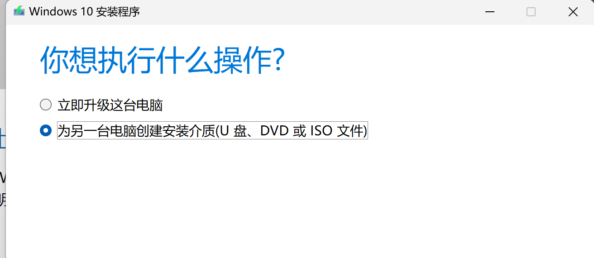

# 新手使用指南
```
三千预算进卡吧，加钱加到九万八。十核E7装上去，四路泰坦抱回家。  
4K屏幕组三屏，万元水冷温度压。固态硬盘装三块，硬盘内存使劲加。  
键鼠必花几千块，耳机手柄八千八。还有机箱一万一，红星炸弹啪啪啪。  
最后发现没啥用，抱着神机刷贴吧。   

三千预算进图吧，学校对面开网吧。AN矿卡是标配，垃圾靠岸笑哈哈。  
坏道迈拓装系统，并口硬盘论车拉。老式志强超频爽，奔腾菜羊够用啦。  
十手矿卡装上去，鱼竿内存满箱插。机箱路边随便捡，安踏鞋盒擦一擦。  
机械键盘自己搞，鼠标一斤一块八。人人手拿七七五，家家双路叉五八。  
萝卜散热效果好，牙膏硅脂温度压。二手便宜质量好，一切信仰就是渣。  

——大人，时代变了，好好装机！本教程面向Windows平台。  
```

## 1、Windows 系统安装

### （1）准备工作
（A）一个U盘（≥8GB），存放安装镜像  
（B）一个联网、可以读写USB的电脑或手机  
（C）一个准备安装系统的PC 

### （2） 创建引导U盘
#### 方法一、官方工具全自动创建

1、下载镜像生成工具：  
Windows 10：https://www.microsoft.com/zh-cn/software-download/windows10  
Windows 11：https://www.microsoft.com/zh-cn/software-download/windows11


2、插入U盘，打开MediaCreationToolxxxx.exe。选择创建安装介质。



3、版本选择Windows 10 / Windows 11，默认包含全版本安装文件。体系一般为x64。


4、选择创建方式。推荐选择**U盘**，一步到位。若需单独使用iso镜像，则选择**ISO文件**。


5、点击下一步（ISO方式记住保存路径，按方法二/三/四继续操作），创建完成。

#### 方法二、手动下载镜像解压

#### 方法三、Rufus写入U盘

#### 方法四、PE类工具安装

### （3）引导启动安装镜像

### （4）可选：注入驱动


