# Ⅷ、硬盘工具

未完待续……

## Win磁盘管理

注：系统自带磁盘管理器仅可编辑分区尾部位置，且无法编辑EFI等高敏感分区。

### （1）新建分区

### （2）删除分区

### （3）压缩卷/减小分区

### （4）扩展卷/增大分区

## DiskGenius

### （1）删除与新建分区

1、右键选择要删除的分区，选择删除当前分区。

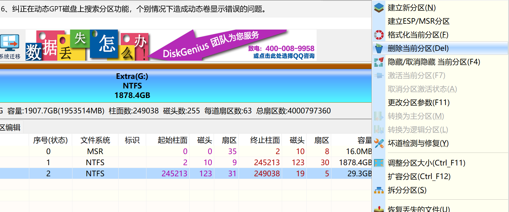

2、在确认当前磁盘没有重要文件，或重要文件已备份后，可以点击“是”按钮以完成删除操作。

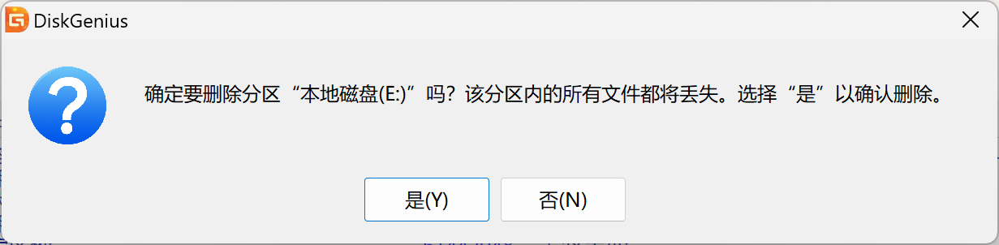

3、右键点击空闲分区（灰色），选择建立新分区。选择文件系统类型、分区大小后确定，最后点击左上角**保存更改**。

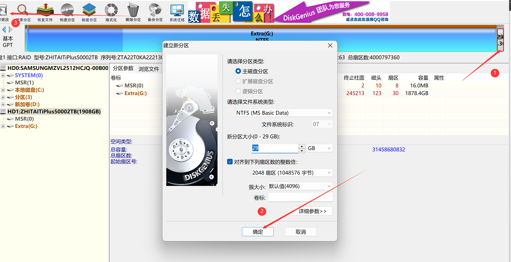

### （2）调整分区大小和位置

注：涉及C盘扩容操作，建议先用DG减小D盘头部空间，然后在系统自带磁盘管理中扩展卷。这一操作流程不需要重启至PE系统。

1、右键需要减小容量的分区，拖动分区条头部或尾部腾出空间。点击左上角保存更改。

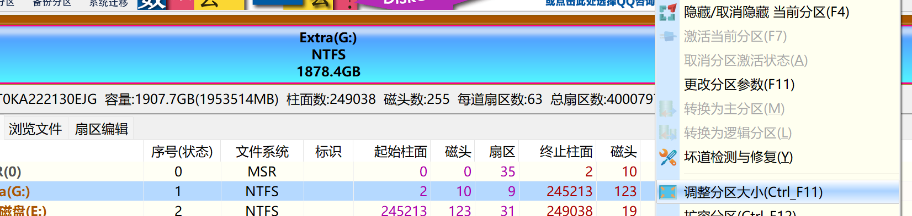

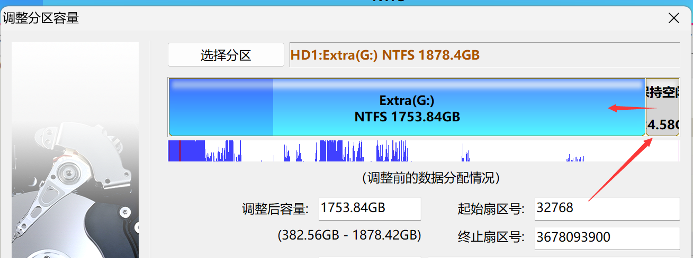

2、右键需要扩容的分区，拖动蓝色区域至所需容量。点击左上角保存更改。

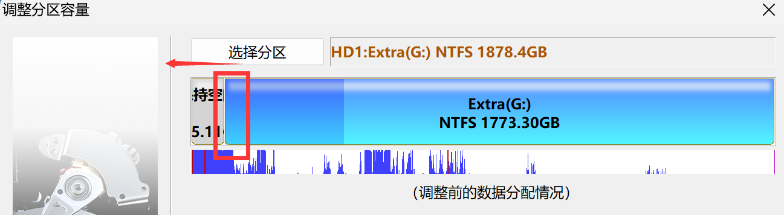

3、缩小分区容量后可直接拖动位置。

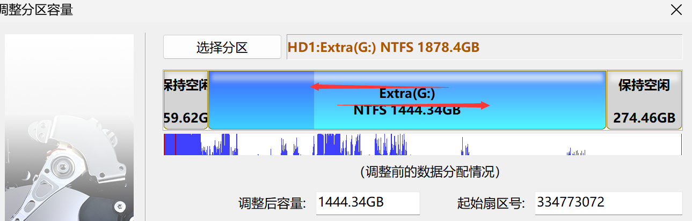

### （3）搜索已丢失的分区

1、点击左侧“分区、目录层次图”中的硬盘条目，点击“工具 - 搜索已丢失分区(重建分区表)”菜单项，也可以点击工具栏上的“搜索分区”按钮。程序弹出“搜索丢失分区”对话框。

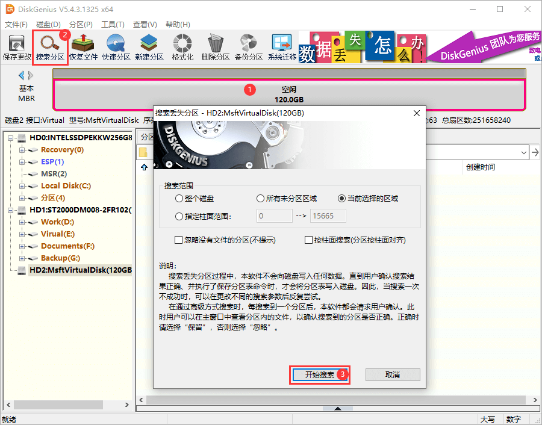

2、可选择的搜索范围有：**整个磁盘**：忽略现有分区，从头到尾搜索整个磁盘。**当前选择的区域**：保留现有分区，并且只在当前选择的空闲区域中搜索分区。**所有未分区区域**：保留现有分区，并且依次搜索所有空闲区域中的已丢失分区。

3、设置好搜索选项后，点击“开始搜索”按钮。

4、搜索到一个分区后，在界面中会显示刚刚搜索到的分区，并弹出下面的提示信息。

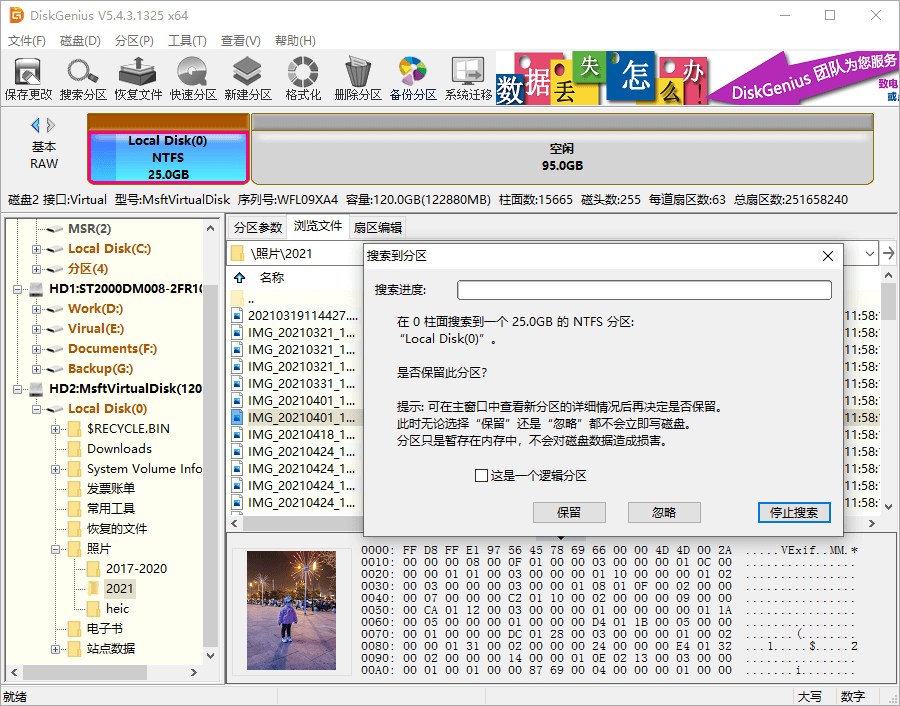

5、搜索完成后，程序弹出下面的提示。在保存分区表后，搜索到的分区可被操作系统识别及访问。

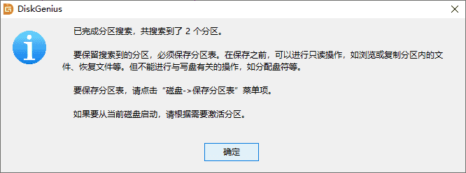

### （4）转换MBR/GPT分区表格式

该功能可在MBR和GPT(GUID)两种分区表类型之间进行无损转换。MBR分区格式支持Legacy启动，且只支持4个主分区和最大2T容量。GPT格式支持UEFI启动，主分区数量和硬盘容量几乎无上限。

1、转换分区表类型为GUID/GPT格式

选择要转换的磁盘后，点击菜单“磁盘 - 转换分区表类型为GUID格式”项。点击“保存更改”按钮保存分区表，让转换实际生效。

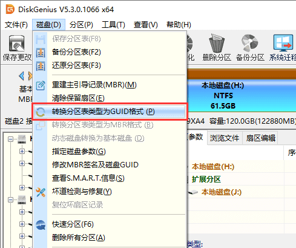

2、转换分区表类型为MBR格式

选择要转换的磁盘后，点击菜单“磁盘 - 转换分区表类型为MBR格式”项。

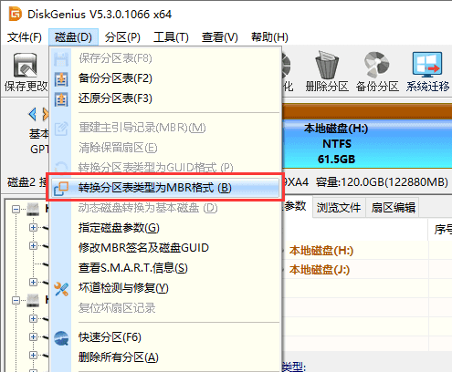

程序弹出如下提示。如果磁盘容量超过2TB，转换为MBR格式后，超过2TB的部分容量将无法使用。另外如果GPT磁盘上安装有基于EFI架构的操作系统，转换到MBR类型后该操作系统将无法启动。确认无误后点击“确定”按钮开始转换。最后点击“保存更改”按钮保存分区表，让转换实际生效。

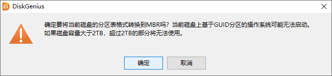

### （5）系统迁移

1、将第二块硬盘、SSD固态硬盘或U盘等，在电脑上安装好，然后启动系统，运行DiskGenius软件。在DiskGenius主菜单，点击“工具 – 系统迁移”菜单项。

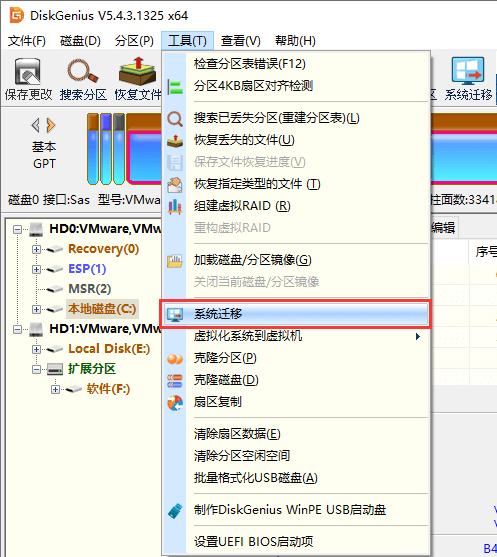

2、选择迁移系统的目标盘，然后点击“确定”按钮。目标磁盘可以小于源磁盘，但是目标磁盘容量需大于源磁盘的已用数据总量。

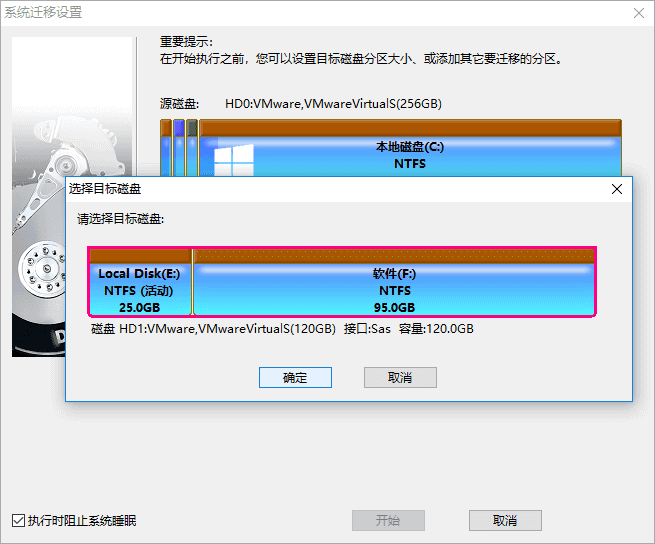

3、对于支持UEFI的电脑，还可以直接指定系统迁移完成后，要不要更改系统的启动项。 点击“开始”按钮，准备进行迁移。

4、程序显示如下警告，目标磁盘上的所有数据将会被覆盖。确认没问题后，点击“确定”按钮。

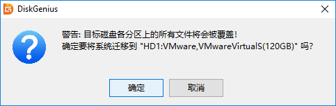

5、DiskGenius软件将让用户**选择系统迁移的模式**。热迁移，就是在不关机的情况下，迁移系统到第二块硬盘，在迁移过程中，用户仍然可以对电脑做各种操作，不影响用户对电脑的使用。重启到WinPE，DiskGenius软件将重启电脑，自动进入WinPE系统，自动在WinPE下启动DiskGenius并自动执行系统迁移。为方便、安全，建议使用这种**系统迁移模式**。

6、完成系统迁移后，DiskGenius软件会给出系统迁移完成的提示。系统迁移到第二块硬盘（或SSD固态硬盘、U盘等）上之后，如果是支持UEFI的电脑，并且在迁移系统之前设置了完成后从目标盘启动。重启电脑后，会自动用迁移后的新系统启动。否则，需手动进入BIOS设置，将启动硬盘设置为新的硬盘，之后，就可以用这块硬盘启动电脑，进入系统了。

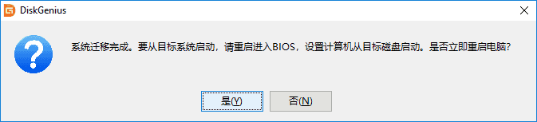

### （6）SMART信息

1、在软件中选择需要查看S.M.A.R.T. 信息的硬盘。

2、 点击“磁盘”菜单，选择“查看S.M.A.R.T.信息”选项。

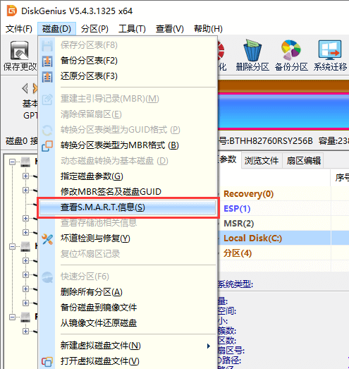

3、在弹出的窗口上可以看到硬盘的S.M.A.R.T. 信息。

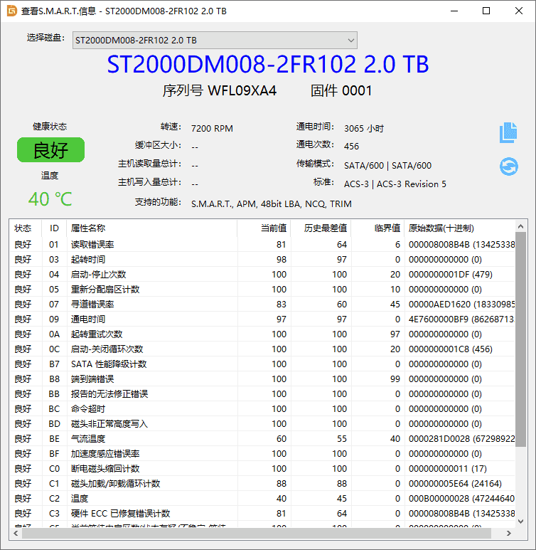

### （7）HDD坏道检测与修复

1、此功能用于搜索机械硬盘的坏道，不适用于SSD的坏块检测。首先选择需要检测坏道的磁盘，然后点击“磁盘 - 坏道检测与修复”菜单项。

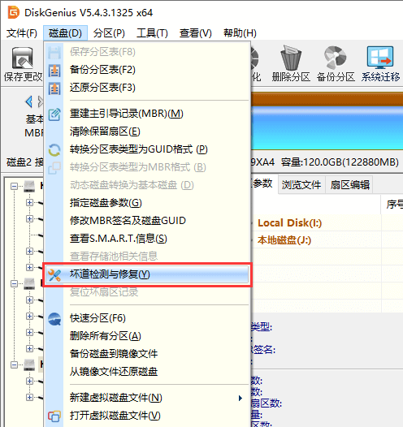

2、程序弹出如下对话框，设定检测范围(柱面范围)，点击“开始检测”按钮，软件即开始检测坏道。

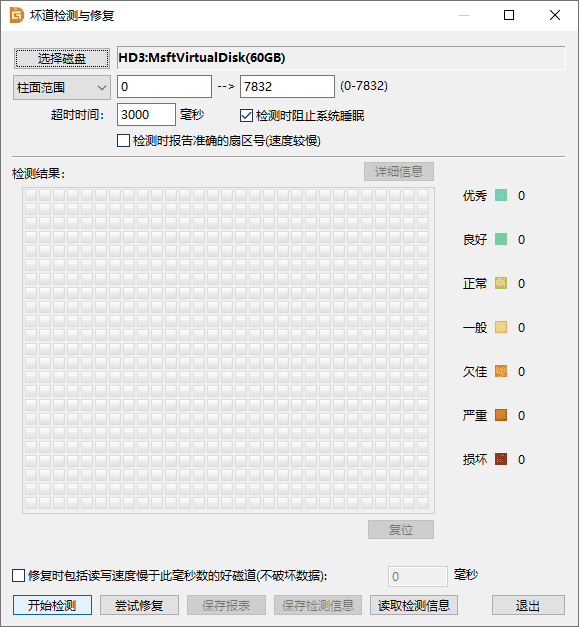

3、发现坏道时软件会将坏道情况显示在对话框中，红色“损坏”表示坏道。

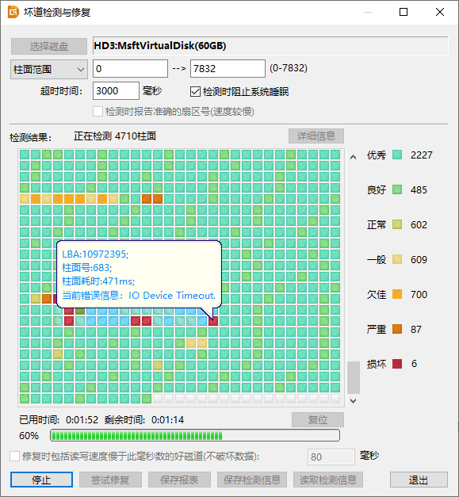

4、检测过程中遇到坏道时，检测速度会变慢。检测完毕，软件报告检测到的坏道数目。

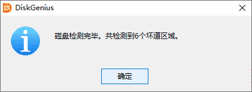

5、可以通过点击“保存报表”按钮，将检测结果保存到一个文本文件中。如果要立即尝试修复刚刚检测到的坏道，可点击“尝试修复”按钮。显示下面的提示。

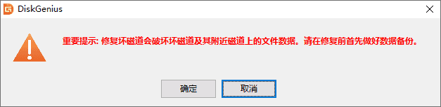

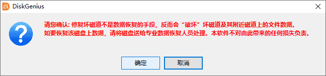

6、如果修复成功，将鼠标悬停在柱面方格上空，提示显示“已修复”。

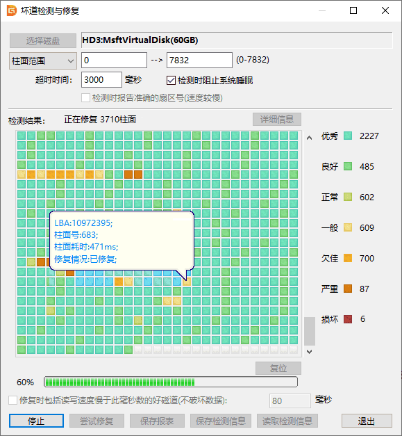

7、无法修复的坏道建议重新分区屏蔽，坏道所在区域不要纳入分区，避免扩散。

### （8）重建MBR引导

MBR硬盘可使用DG重建引导。在左侧栏选择硬盘，点击菜单栏**磁盘**→**重建主引导记录**。类似的，可以调整存储分区头部位置后重建ESP-MSR分区，随后可在PE中重建EFI引导。

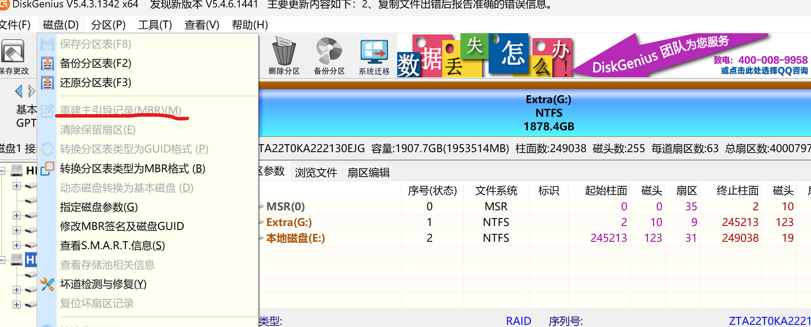

## CrystalDiskInfo

## CrystalDiskMark

## 三星固态PN号速查表

