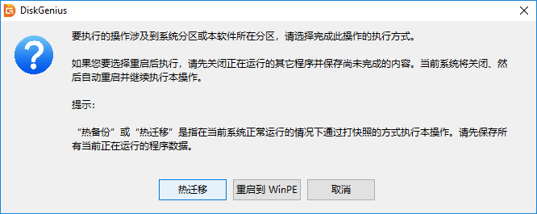

# Ⅷ、硬盘工具

未完待续……

## Windows自带的磁盘管理

注：系统自带磁盘管理器仅可编辑分区尾部位置，且无法编辑EFI等高敏感分区。

### （1）新建分区

### （2）删除分区

### （3）压缩卷/减小分区

### （4）扩展卷/增大分区

## MacOS的磁盘工具

## DiskGenius

### （1）删除与新建分区

1、右键选择要删除的分区，选择删除当前分区。

2、在确认当前磁盘没有重要文件，或重要文件已备份后，可以点击“是”按钮以完成删除操作。

3、右键点击空闲分区（灰色），选择建立新分区。选择文件系统类型、分区大小后确定，最后点击左上角**保存更改**。

### （2）调整分区大小和位置

注：涉及C盘扩容操作，建议先用DG减小D盘头部空间，然后在系统自带磁盘管理中扩展卷。这一操作流程不需要重启至PE系统。

1、右键需要减小容量的分区，拖动分区条头部或尾部腾出空间。点击左上角保存更改。

2、右键需要扩容的分区，拖动蓝色区域至所需容量。点击左上角保存更改。

3、缩小分区容量后可直接拖动位置。

### （3）搜索已丢失的分区

1、点击左侧“分区、目录层次图”中的硬盘条目，点击“工具 - 搜索已丢失分区(重建分区表)”菜单项，也可以点击工具栏上的“搜索分区”按钮。程序弹出“搜索丢失分区”对话框。

2、可选择的搜索范围有：**整个磁盘**：忽略现有分区，从头到尾搜索整个磁盘。**当前选择的区域**：保留现有分区，并且只在当前选择的空闲区域中搜索分区。**所有未分区区域**：保留现有分区，并且依次搜索所有空闲区域中的已丢失分区。

3、设置好搜索选项后，点击“开始搜索”按钮。

4、搜索到一个分区后，在界面中会显示刚刚搜索到的分区，并弹出下面的提示信息。

5、搜索完成后，程序弹出下面的提示。在保存分区表后，搜索到的分区可被操作系统识别及访问。

### （4）转换MBR/GPT分区表格式

该功能可在MBR和GPT(GUID)两种分区表类型之间进行无损转换。MBR分区格式支持Legacy启动，且只支持4个主分区和最大2T容量。GPT格式支持UEFI启动，主分区数量和硬盘容量几乎无上限。

1、转换分区表类型为GUID/GPT格式

选择要转换的磁盘后，点击菜单“磁盘 - 转换分区表类型为GUID格式”项。点击“保存更改”按钮保存分区表，让转换实际生效。

2、转换分区表类型为MBR格式

选择要转换的磁盘后，点击菜单“磁盘 - 转换分区表类型为MBR格式”项。

程序弹出如下提示。如果磁盘容量超过2TB，转换为MBR格式后，超过2TB的部分容量将无法使用。另外如果GPT磁盘上安装有基于EFI架构的操作系统，转换到MBR类型后该操作系统将无法启动。确认无误后点击“确定”按钮开始转换。最后点击“保存更改”按钮保存分区表，让转换实际生效。

### （5）系统迁移

1、将第二块硬盘、SSD固态硬盘或U盘等，在电脑上安装好，然后启动系统，运行DiskGenius软件。在DiskGenius主菜单，点击“工具 – 系统迁移”菜单项。

2、选择迁移系统的目标盘，然后点击“确定”按钮。目标磁盘可以小于源磁盘，但是目标磁盘容量需大于源磁盘的已用数据总量。

3、对于支持UEFI的电脑，还可以直接指定系统迁移完成后，要不要更改系统的启动项。 点击“开始”按钮，准备进行迁移。

4、程序显示如下警告，目标磁盘上的所有数据将会被覆盖。确认没问题后，点击“确定”按钮。

5、DiskGenius软件将让用户**选择系统迁移的模式**。热迁移，就是在不关机的情况下，迁移系统到第二块硬盘，在迁移过程中，用户仍然可以对电脑做各种操作，不影响用户对电脑的使用。重启到WinPE，DiskGenius软件将重启电脑，自动进入WinPE系统，自动在WinPE下启动DiskGenius并自动执行系统迁移。为方便、安全，建议使用这种**系统迁移模式**。

6、完成系统迁移后，DiskGenius软件会给出系统迁移完成的提示。系统迁移到第二块硬盘（或SSD固态硬盘、U盘等）上之后，如果是支持UEFI的电脑，并且在迁移系统之前设置了完成后从目标盘启动。重启电脑后，会自动用迁移后的新系统启动。否则，需手动进入BIOS设置，将启动硬盘设置为新的硬盘，之后，就可以用这块硬盘启动电脑，进入系统了。

### （6）SMART信息

1、在软件中选择需要查看S.M.A.R.T. 信息的硬盘。

2、 点击“磁盘”菜单，选择“查看S.M.A.R.T.信息”选项。

3、在弹出的窗口上可以看到硬盘的S.M.A.R.T. 信息。

### （7）HDD坏道检测与修复

1、此功能用于搜索机械硬盘的坏道，不适用于SSD的坏块检测。首先选择需要检测坏道的磁盘，然后点击“磁盘 - 坏道检测与修复”菜单项。

2、程序弹出如下对话框，设定检测范围(柱面范围)，点击“开始检测”按钮，软件即开始检测坏道。

3、发现坏道时软件会将坏道情况显示在对话框中，红色“损坏”表示坏道。

4、检测过程中遇到坏道时，检测速度会变慢。检测完毕，软件报告检测到的坏道数目。

5、可以通过点击“保存报表”按钮，将检测结果保存到一个文本文件中。如果要立即尝试修复刚刚检测到的坏道，可点击“尝试修复”按钮。显示下面的提示。

6、如果修复成功，将鼠标悬停在柱面方格上空，提示显示“已修复”。

7、无法修复的坏道建议重新分区屏蔽，坏道所在区域不要纳入分区，避免扩散。

### （8）重建MBR引导

MBR硬盘可使用DG重建引导。在左侧栏选择硬盘，点击菜单栏**磁盘**→**重建主引导记录**。类似的，可以调整存储分区头部位置后重建ESP-MSR分区，随后可在PE中重建EFI引导。

## 三星固态PN号速查表

| 硬盘           | 规格             | 主控                                   | 颗粒              | 接口                            | 16GB/24GB    | 32GB         | 64GB         | 120/128GB    | 192/200/240/250/256GB | 480/500/512GB   | 800GB/960GB/1TB | 1.6 TB/1.92TB/2TB          | 3.2 TB/3.84TB              | 6.4 TB/7.68TB | 12.8 TB/15.36TB | 30TB         |
| -------------- | ---------------- | -------------------------------------- | ----------------- | ------------------------------- | ------------ | ------------ | ------------ | ------------ | --------------------- | --------------- | --------------- | -------------------------- | -------------------------- | ------------- | --------------- | ------------ |
| 零售级SSD      |                  |                                        |                   |                                 |              |              |              |              |                       |                 |                 |                            |                            |               |                 |              |
| 950PRO         | M.2 2280 M key   | S4LN05A01-8030 UBX                     |                   | M.2 PCIE3.0X4 NVMe              |              |              |              |              |                       |                 |                 |                            |                            |               |                 |              |
| 960EVO         | M.2 2280 M key   | S4LP077X01-8030 POLARIS                | 48L TLC           | M.2 PCIE3.0X4 NVMe              |              |              |              |              | MZVLW250HEHP          | MZVLW500HMJP    | MZVLW1T0HMLH    |                            |                            |               |                 |              |
| 960EVO新       | M.2 2280 M key   | S4LP077X01-8030 POLARIS                | 48L TLC           | M.2 PCIE3.0X4 NVMe              |              |              |              |              |                       | MZVLW500HAJQ    | MZVLW1T0HALR    |                            |                            |               |                 |              |
| 960PRO         | M.2 2280 M key   | S4LP077X01-8030 POLARIS K3QF4F4OBMFGCF | 48L MLC           | M.2 PCIE3.0X4 NVMe              |              |              |              |              |                       | MZVKP500HMHQ    | MZVKP1T0HMJP    | MZVKP2T0HMLP               |                            |               |                 |              |
| 970EVO         | M.2 2280 M key   | S4LR020 PHOENIX                        | 64L TLC           | M.2 PCIE3.0X4 NVMe              |              |              |              |              | MZVLB250HAHQ          | MZVLB500HAJQ    | MZVLB1T0HALR    | MZVLB2T0HMLB               |                            |               |                 |              |
| 970PRO         | M.2 2280 M key   | S4LR020 PHOENIX                        | 64L MLC           | M.2 PCIE3.0X4 NVMe              |              |              |              |              |                       | MZVKB500HAJQ    | MZVKB1T0HALR    |                            |                            |               |                 |              |
| 970EVOPlus     | M.2 2280 M key   | S4LR020 PHOENIX                        | 92L TLC           | M.2 PCIE3.0X4 NVMe              |              |              |              |              | MZVLB250HBHQ          | MZVLB500HBJQ    | MZVLB1T0HBLR    | MZVLB2T0HALB               |                            |               |                 |              |
| 970EVOPlus新   | M.2 2280 M key   | S4LV003 ELPIS                          | 128L TLC          | M.2 PCIE3.0X4 NVMe              |              |              |              |              |                       |                 | MZVL21T0HBLU    |                            |                            |               |                 |              |
| 980            | M.2 2280 M key   | S4LR033 PABLO                          | 128L TLC          | M.2 PCIE3.0X4 NVMe              |              |              |              |              | MZVLQ250HBJD          | MZVLQ500HBLU    |                 |                            |                            |               |                 |              |
| 980PRO         | M.2 2280 M key   | S4LV003 ELPIS                          | 128L TLC          | M.2 PCIE4.0X4 NVMe              |              |              |              |              | MZBL2250HCHQ          | MZVL2500HCJQ    | MZVL21T0HCLR    | MZVL22T0HBLB               |                            |               |                 |              |
| 990PRO         | M.2 2280 M key   | S4LV008 PASCAL                         | 176L TLC          | M.2 PCIE4.0X4 NVMe              |              |              |              |              |                       |                 | MZVL21T0HDLU    | MZVL22T0HDLB               |                            |               |                 |              |
| 470            | 2.5寸 7mm        | S3C29MAX01-Y340 MAX                    | 32nm MLC          | SATA 2.0                        |              |              | MZ5PA064HMCD | MZ5PA128HMCD | MZ5PA256HMDR          |                 |                 |                            |                            |               |                 |              |
| 650            | 2.5寸 7mm        | S4LN054X02 MFX2                        | 32L TLC           | SATA 3.0                        |              |              |              |              |                       |                 |                 |                            |                            |               |                 |              |
| 750EVO         | 2.5寸 7mm        | S4LN062X01-Y030 MGX Maia               | 16nm TLC          | SATA 3.0                        |              |              |              | MZ7TY120     | MZ7TY250              | MZ7TN500        |                 |                            |                            |               |                 |              |
| 830            | 2.5寸 7mm        | S4LJ204X01-Y040 MCX                    | 27nm MLC          | SATA 3.0                        |              |              | MZ7PC064HADR | MZ7PC128HAFU | MZ7PC256HAFU          |                 |                 |                            |                            |               |                 |              |
| 840            | M.2 2280 B&M key | S4LN021X01-8030 MDX                    | 21nm TLC          | SATA 3.0                        |              |              |              | MZ7TD128HAFV | MZ7TD256HAFV          | MZ7TD512HAGM    |                 |                            |                            |               |                 |              |
| 840EVO         | 2280             | S4LN045X01-8030 MEX                    | 19nm TLC          | SATA 3.0                        |              |              |              | MZBTE120HMGR | MZBTE250HMHP          | MZBTE500HMHP    |                 |                            |                            |               |                 |              |
| 840EVO         | mSATA            | S4LN045X01-8030 MEX                    | 19nm TLC          | SATA 3.0                        |              |              |              | MZMTE120HMGR | MZMTE250HMHP          | MZMTE500HMHP    |                 |                            |                            |               |                 |              |
| 840EVO         | 2.5寸            | S4LN045X01-8030 MEX                    | 19nm TLC          | SATA 3.0                        |              |              |              | MZ7TE120HMGR | MZ7TE250HMHP          | MZ7TE500HMHP    | MZ7TE1T0HMHP    |                            |                            |               |                 |              |
| 840PRO         | 2.5寸            | S4LN021X01-8030 MDX                    | 21nm MLC          | SATA 3.0                        |              |              |              | MZ7PD128HAFV | MZ7PD256HCGM          | MZ7PD512HCGM    |                 |                            |                            |               |                 |              |
| 850            | 2.5寸            | S4LN062X01-Y030 MGX Maia               | 64L TLC           | SATA 3.0                        |              |              |              |              |                       |                 |                 |                            |                            |               |                 |              |
| 850EVO         | 2.5寸            | S4LN062X01-Y030 MGX Maia               | 48L TLC           | SATA 3.0                        |              |              |              | MZ7LN120     | MZ7LN250              | MZ7LN500        | MZ7LE1T0        |                            |                            |               |                 |              |
| 850EVO>=2TB    | 2.5寸            | S4LP052X01-8030 MHX Mercury            | 48L TLC           | SATA 3.0                        |              |              |              |              |                       |                 |                 | MZ7LM2T0HMJP               | MZ7LM4T0HMLP               |               |                 |              |
| 850PRO         | 2.5寸            | S4LN045X01-8030 MEX                    | 19nm MLC          | SATA 3.0                        |              |              |              |              |                       |                 | MZ7KM1T0HMJP    | MZ7KM2T0HMJP               | MZ7KM4T0HMLP               |               |                 |              |
| 850PRO         | 2.5寸            | S4LN045X01-8030 MEX                    | 19nm MLC,14nm MLC | SATA 3.0                        |              |              |              | MZ7KE128HMGA | MZ7KE256HMHA          | MZ7KE512HMHA/GR | MZ7KE1T0HMHP/JB | MZ7KM2T0HAJL               | MZ7KM4T0HMLS               |               |                 |              |
| 850PRO新       | 2.5寸            | S4LP052X01-8030 MHX Mercury            | 14nm MLC          | SATA 3.0                        |              |              |              | MZ7KE128HAFD | MZ7KE256HAGR          | MZ7KE512HAGR    | MZ7KE1T0HAHP    |                            |                            |               |                 |              |
| 860QVO         | 2.5寸            | S4LR030 MJX Maru                       | 64L QLC           | SATA 3.0                        |              |              |              |              |                       |                 | MZ7MH1T0HMLD    | MZ7MH2T0HMLC               | MZ7MH4T0HMLC               |               |                 |              |
| 860EVO         | M.2 2280 B&M key | S4LR030 MJX Maru                       | 64L TLC           | SATA 3.0                        |              |              |              |              | MZNLH250HAHQ          | MZNLH500HMJD    | MZNLH1T0HMLU    | MZNLH2T0HMLA               |                            |               |                 |              |
| 860EVO         | mSATA            | S4LR030 MJX Maru                       | 64L TLC           | SATA 3.0                        |              |              |              |              | MZBLH250HAHQ          | MZBLH500HMJD    | MZBLH1T0HMLU    | MZBLH2T0HMLA               |                            |               |                 |              |
| 860EVO         | 2.5寸 7mm        | S4LR030 MJX Maru                       | 64L TLC           | SATA 3.0                        |              |              |              |              | MZ7LH250HAHQ          | MZ7LH500HMJD    | MZ7LH1T0HMLU    | MZ7LH2T0HMLA               |                            |               |                 |              |
| 860PRO         | 2.5寸 7mm        | S4LR030 MJX Maru                       | 64L MLC           | SATA 3.0                        |              |              |              |              | MZ7KH256HAHQ          | MZ7KH512HAJQ    | MZ7KH1T0HAJR    | MZ7KH2T0HAJR               | MZ7KH4T0HALS               |               |                 |              |
| 870QVO         | 2.5寸 7mm        | S4LR059 MKX Metis                      | 128L QLC          | SATA 3.0                        |              |              |              |              |                       |                 | MZ7M31T0HALD    | MZ7M32T0HALC               | MZ7M34T0HALC               | MZ7M38T0HALC  |                 |              |
| 870EVO         | 2.5寸 7mm        | S4LR059 MKX Metis                      | 128L TLC          | SATA 3.0                        |              |              |              |              |                       | MZ7L3512HBLU    | MZ7L31T0HBLB    | MZ7L32T0HBLT               | MZ7L34T0HBLA               |               |                 |              |
| 845 DC EVO     |                  | S4LN021X01-8030 MDX                    |                   |                                 |              |              |              |              |                       |                 |                 |                            |                            |               |                 |              |
| 860DCT         | 2.5寸            | S4LR030 MJX Maru                       |                   | SATA 3.0                        |              |              |              |              |                       |                 | MZ7LH960HMLU    | MZ7LH1T9HMLT               | MZ7LH3T8HMLT               |               |                 |              |
| 883DCT         | 2.5寸            | S4LR030 MJX Maru                       |                   | SATA 3.0                        |              |              |              |              | MZ7LH240HAHQ          | MZ7LH480HAHQ    | MZ7LH960HAJR    | MZ7LH1T9HMLT               | MZ7LH3T8HMLT               |               |                 |              |
| 983DCT         | M.2 22110 M key  | S4LR020 PHOENIX                        | 64L TLC           | M.2 PCIE3.0X4 NVMe              |              |              |              |              |                       |                 | MZ1LB960HAJQ    | MZ1LB1T9HALS               |                            |               |                 |              |
|                |                  |                                        |                   |                                 |              |              |              |              |                       |                 |                 |                            |                            |               |                 |              |
| Client SSD     | M.2              |                                        |                   |                                 |              |              |              |              |                       |                 |                 |                            |                            |               |                 |              |
| XP941          | 2280             | S4LN053X01-8030 SSUAX                  | 19nm MLC          | M.2 PCIE2.0X4 AHCI              |              |              |              | MZHPU128HCGM | MZHPU256HCGL          | MZHPU512HCGL    |                 |                            |                            |               |                 |              |
| SM951          | 2280             | S4LN05A01-8030 UBX                     | 16nm MLC          | M.2 PCIE3.0X4 NVMe              |              |              |              | MZVPV128HDGM | MZVPV256HDGL          | MZVPV512HDGL    |                 |                            |                            |               |                 |              |
| SM951          | 2280             | S4LN05A01-8030 UBX                     | 16nm MLC          | M.2 PCIE3.0X4 AHCI              |              |              |              | MZHPV128HDGM | MZHPV256HDGL          | MZHPV512HDGL    |                 |                            |                            |               |                 |              |
| SM951A         | 2280             | S4LN05A01-8030 UBX                     | 32L MLC           | M.2 PCIE3.0X4 NVMe              |              |              |              | MZVKV128HAGR | MZVKV256HAHP          | MZVKV512HAJH    | MZVKV1T0HAJH    |                            |                            |               |                 |              |
| SM951A         | 2280             | S4LN05A01-8030 UBX                     | 32L MLC           | M.2 PCIE3.0X4 AHCI              |              |              |              | MZFKV128HAGR | MZFKV256HAHP          | MZFKV512HAJH    | MZFKV1T0HAJH    |                            |                            |               |                 |              |
| PM951          | 2280             | S4LN05A01-8030 UBX                     | 32L TLC           | M.2 PCIE3.0X4 NVMe              |              |              |              | MZVLV128HCGR | MZVLV256HCHP          | MZVLV512HCJH    |                 |                            |                            |               |                 |              |
| PM951          | 2280             | S4LN05A01-8030 UBX                     | 32L TLC           | M.2 PCIE3.0X4 AHCI              |              |              |              | MZFLV128HCGR | MZFLV256HCHP          | MZFLV512HCJH    | MZFKW1T0HMLH    |                            |                            |               |                 |              |
| SM961          | 2280             | S4LP077X01-8030 POLARIS                | 14nm MLC,48L MLC  | M.2 PCIE3.0X4 AHCI              |              |              |              | MZFPW128HEGM | MZFPW256HEGL          | MZFKW512HMJP    | MZFKW1T0HMLH    |                            |                            |               |                 |              |
| SM961          | 2280             | S4LP077X01-8030 POLARIS                | 48L MLC           | M.2 PCIE3.0X4 NVMe              |              |              |              | MZVPW128HEGM | MZVPW256HEGL          | MZVKW512HMJP    | MZVKW1T0HMLH    |                            |                            |               |                 |              |
| PM961          | 2280             | S4LP077X01-8030 POLARIS                | 48L TLC           | M.2 PCIE3.0X4 AHCI              |              |              |              | MZFLW128HEGR | MZFLW256HEHP          | MZFLW512HMJP    | MZFLW1T0HMLH    |                            |                            |               |                 |              |
| PM961          | 2280             | S4LP077X01-8030 POLARIS                | 48L TLC           | M.2 PCIE3.0X4 NVMe              |              |              |              | MZVLW128HEGR | MZVLW256HEHP          | MZVLW512HMJP    | MZVLW1T0HMLH    |                            |                            |               |                 |              |
| PM971          | 2230             | S4LP132X01 PHOTON                      | 48L TLC           | M.2 PCIE3.0X2 NVMe              |              |              |              | MZ2LZ128HMHP | MZ2LZ256HMJP          | MZ2LZ512HMLH    |                 |                            |                            |               |                 |              |
| PM971          | BGA              | S4LP132X01 PHOTON                      | 48L TLC           | M.2 PCIE3.0X4 NVMe              |              |              |              |              | KUS020203M-B000       | KUS030203M-B000 |                 |                            |                            |               |                 |              |
| PM971A         | BGA              | S4LP132X01 PHOTON                      | 64L TLC           | M.2 PCIE3.0X4 NVMe              |              |              |              |              | KUS020205M-B000       | KUS030205B-B000 |                 |                            |                            |               |                 |              |
| PM981          | 2280             | S4LR020 PHOENIX                        | 64L TLC           | M.2 PCIE3.0X4 NVMe              |              |              |              |              | MZVLB256HAHQ          | MZVLB512HAJQ    | MZVLB1T0HALR    | MZVLB2T0HMLB               |                            |               |                 |              |
| PM981A         | 2280             | S4LR020 PHOENIX                        | 92L TLC           | M.2 PCIE3.0X4 NVMe              |              |              |              |              | MZVLB256HBHQ          | MZVLB512HBJQ    | MZVLB1T0HBLR    | MZVLB2T0HALB               |                            |               |                 |              |
| PM991          | M.2 2230 M key   | S4LR033 PABLO                          | 92L TLC           | M.2 PCIE3.0X4 NVMe              |              |              |              | MZ9LQ128HBHQ | MZ9LQ256HAJD          | MZ9LQ512HALU    | MZ9LQ1T0HALB    |                            |                            |               |                 |              |
| PM991          | M.2 2242 M key   | S4LR033 PABLO                          | 92L TLC           | M.2 PCIE3.0X4 NVMe              |              |              |              | MZALQ128HBHQ | MZALQ256HAJD          | MZALQ512HALU    | MZALQ1T0HALB    |                            |                            |               |                 |              |
| PM991          | M.2 2280 M key   | S4LR033 PABLO                          | 92L TLC           | M.2 PCIE3.0X4 NVMe              |              |              |              | MZVLQ128HBHQ | MZVLQ256HAJD          | MZVLQ512HALU    | MZVLQ1T0HALB    |                            |                            |               |                 |              |
| PM991A         | 2230             | S4LR033 PABLO                          | 128L TLC          | M.2 PCIE3.0X4 NVMe              |              |              |              | MZ9LQ128HCHQ | MZ9LQ256HBJD          | MZ9LQ512HBLU    | MZ9LQ1T0HBLB    |                            |                            |               |                 |              |
| PM991A         | 2242             | S4LR033 PABLO                          | 128L TLC          | M.2 PCIE3.0X4 NVMe              |              |              |              | MZALQ128HCHQ | MZALQ256HBJD          | MZALQ512HBLU    | MZALQ1T0HBLB    |                            |                            |               |                 |              |
| PM991A         | 2280             | S4LR033 PABLO                          | 128L TLC          | M.2 PCIE3.0X4 NVMe              |              |              |              | MZVLQ128HCHQ | MZVLQ256HBJD          | MZVLQ512HBLU    | MZVLQ1T0HBLB    |                            |                            |               |                 |              |
| PM9A1          | 2280             | S4LV003 ELPIS                          | 128L TLC          | M.2 PCIE4.0X4 NVMe              |              |              |              |              | MZVL2256HCHQ          | MZVL2512HCJQ    | MZVL21T0HCLR    | MZVL22T0HBLB               |                            |               |                 |              |
| PM9A1A         | 2280             | S4LV003 ELPIS                          | 176L TLC          | M.2 PCIE4.0X4 NVMe              |              |              |              |              |                       | MZVL2512HDJD    | MZVL21T0HDLU    | MZVL22T0HDLB               |                            |               |                 |              |
| PM9B1          | 2242             | 88SS1322                               | 128L TLC          | M.2 PCIE4.0X4 NVMe              |              |              |              |              | MZAL4256HBJD          | MZAL4512HBLU    | MZAL41T0HBLB    |                            |                            |               |                 |              |
| PM9B1          | 2280             | 88SS1322                               | 128L TLC          | M.2 PCIE4.0X4 NVMe              |              |              |              |              | MZVL4256HBJD          | MZVL4512HBLU    | MZVL41T0HBLB    |                            |                            |               |                 |              |
| PM9C1          |                  |                                        | 176L TLC          | M.2 PCIE4.0X4 NVMe              |              |              |              |              |                       |                 |                 |                            |                            |               |                 |              |
| PM9C1A         |                  |                                        | 176L TLC          | M.2 PCIE4.0X4 NVMe              |              |              |              |              |                       |                 |                 |                            |                            |               |                 |              |
|                |                  |                                        |                   |                                 |              |              |              |              |                       |                 |                 |                            |                            |               |                 |              |
| Client SSD     | SATA             |                                        |                   |                                 |              |              |              |              |                       |                 |                 |                            |                            |               |                 |              |
| PM881          | 2280             | S4LR030 MJX Maru                       |                   | M.2 SATA                        |              |              |              | MZNLH128HBHQ | MZNLH256HAJD          | MZNLH512HALU    | MZNLH1T0HALB    |                            |                            |               |                 |              |
| PM881          | 2.5寸            | S4LN062X01-Y030 MGX Maia               |                   | SATA 3.0                        |              |              |              | MZ7LH128HBHQ | MZ7LH256HAJD          | MZ7LH512HALU    | MZ7LH1T0HALB    |                            |                            |               |                 |              |
| SM871          | 2.5寸            | S4LN062X01-Y030 MGX Maia               |                   | SATA 3.0                        |              |              |              | MZ7KN128HAHP | MZ7KN256HAHP          | MZ7KN512HAHP    |                 |                            |                            |               |                 |              |
| PM871B         | 2280             | S4LN062X01-Y030 MGX Maia               |                   | M.2 SATA                        |              |              |              | MZNLN128HAHQ | MZNLN256HAJQ          | MZNLN512HAJQ    | MZNLN1T0HALR    |                            |                            |               |                 |              |
| PM871B         | 2.5寸            | S4LN062X01-Y030 MGX Maia               |                   | SATA 3.0                        |              |              |              | MZ7LN128HAHQ | MZ7LN256HAJQ          | MZ7LN512HAJQ    | MZ7LN1T0HAJQ    |                            |                            |               |                 |              |
| PM871A         | 2280             | S4LN062X01-Y030 MGX Maia               |                   | M.2 SATA                        |              |              |              |              | MZNLN256HMHQ          | MZNLN512HMJP    | MZNLN1T0HMLH    |                            |                            |               |                 |              |
| PM871A         | 2.5寸            | S4LN062X01-Y030 MGX Maia               |                   | SATA 3.0                        |              |              |              |              | MZ7LN256HMJP          | MZ7LN512HMJP    | MZ7LN1T0HMJP    |                            |                            |               |                 |              |
| PM871          | 2280             | S4LN062X01-Y030 MGX Maia               |                   | M.2 SATA                        |              |              |              | MZNLN128HCGR | MZNLN256HCHP          | MZNLN512HCJH    |                 |                            |                            |               |                 |              |
| PM871          | mSATA            | S4LN062X01-Y030 MGX Maia               |                   | SATA 3.0                        |              |              |              | MZMLN128HCHP | MZMLN256HCHP          | MZMLN512HCHP    |                 |                            |                            |               |                 |              |
| PM871          | 2.5寸            | S4LN062X01-Y030 MGX Maia               |                   | SATA 3.0                        |              |              |              | MZ7LN128HCHP | MZ7LN256HCHP          | MZ7LN512HCHP    |                 |                            |                            |               |                 |              |
| CM871          | 2280             | S4LN054X02 MFX2                        |                   | M.2 SATA                        |              |              |              | MZNLF128HCHP | MZNLF192HCGS          |                 |                 |                            |                            |               |                 |              |
| CM871          | 2.5寸            | S4LN054X02 MFX2                        |                   | SATA 3.0                        |              |              |              | MZ7LF128HCHP | MZ7LF192HCGS          |                 |                 |                            |                            |               |                 |              |
| CM871A         | 2280             | S4LN062X01-Y030 MGX Maia               |                   | M.2 SATA                        |              |              |              | MZNTY128HDHP | MZNTY256HDHP          |                 |                 |                            |                            |               |                 |              |
| CM871A         | 2.5寸            | S4LN062X01-Y030 MGX Maia               |                   | SATA 3.0                        |              |              |              | MZYTY128HDHP | MZYTY256HDHP          |                 |                 |                            |                            |               |                 |              |
| PM853T         | 2.5寸            | S4LN045X01-8030 MEX                    |                   | SATA 3.0                        |              |              |              |              | MZ7GE240HMGR          | MZ7GE480HMHP    | MZ7GE960HMHP    |                            |                            |               |                 |              |
| PM851A         |                  | S4LN045X01-8030 MEX                    |                   | SATA 3.0                        |              |              |              |              |                       |                 |                 |                            |                            |               |                 |              |
| PM851          | 2280             | S4LN045X01-8030 MEX                    |                   | SATA 3.0                        |              |              |              | MZNTE128HMJR | MZNTE256HMHP          | MZNTE512HMJH    |                 |                            |                            |               |                 |              |
| PM851          | mSATA            | S4LN045X01-8030 MEX                    |                   | SATA 3.0                        |              |              |              | MZMTE128HMGR | MZMTE256HMHP          | MZMTE512HMHP    |                 |                            |                            |               |                 |              |
| PM851          | 2.5寸            | S4LN045X01-8030 MEX                    |                   | SATA 3.0                        |              |              |              | MZ7TE128HMGR | MZ7TE256HMHP          | MZ7TE512HMHP    |                 |                            |                            |               |                 |              |
| CM851          | 2242             | S4LN054X01 MFX                         |                   | SATA 3.0                        | MZAPF016HCDD | MZAPF032HCFV | MZMPF064HCGM |              |                       |                 |                 |                            |                            |               |                 |              |
| SM841N         | mSATA            | S4LN021X01-8030 MDX                    |                   | SATA 3.0                        |              |              |              | MZMPD128HCFV | MZMPD256HCGM          | MZMPD512HCGL    |                 |                            |                            |               |                 |              |
| SM841N         | 2.5寸            | S4LN021X01-8030 MDX                    |                   | SATA 3.0                        |              |              |              | MZ7PD128HCFV | MZ7PD256HCGM          | MZ7PD512HCGM    |                 |                            |                            |               |                 |              |
| SM841          | mSATA            | S4LN021X01-8030 MDX                    |                   | SATA 3.0                        |              |              |              | MZMPD128HAFV | MZMPD256HAGM          | MZMPD512HAGL    |                 |                            |                            |               |                 |              |
| SM841          | 2.5寸            | S4LN021X01-8030 MDX                    |                   | SATA 3.0                        |              |              |              | MZ7PD128HAFV | MZ7PD256HAFV          | MZ7PD512HAGM    |                 |                            |                            |               |                 |              |
| PM841          | mSATA            | S4LN021X01-8030 MDX                    |                   | SATA 3.0                        |              |              |              | MZMTD128HAFV | MZMTD256HAGM          | MZMTD512HAGL    |                 |                            |                            |               |                 |              |
| PM841          | 2.5寸            | S4LN021X01-8030 MDX                    |                   | SATA 3.0                        |              |              |              | MZ7TD128HAFV | MZ7TD256HAFV          | MZ7TD512HAGM    |                 |                            |                            |               |                 |              |
| PM830          | mSATA            | S4LJ204X01-Y040 MCX                    | MLC               | SATA 3.0                        |              | MZMPC032HBCD | MZMPC064HBDR | MZMPC128HBFU | MZMPC256HBGJ          |                 |                 |                            |                            |               |                 |              |
| PM830          | 2.5寸            | S4LJ204X01-Y040 MCX                    | MLC               | SATA 3.0                        |              |              |              | MZ7PC128HAFU | MZ7PC256HAFU          | MZ7PC512HBGH    |                 |                            |                            |               |                 |              |
| PM830          | 29pin LIF(sony)  | S4LJ204X01-Y040 MCX                    | MLC               | SATA 3.0 RAID 0                 |              |              |              | MZRPC128HACD | MZRPC256HADR          | MZRPC512HAFU    |                 |                            |                            |               |                 |              |
| PM810          | uSATA 1.8inch    | S3C29MAX01-Y340 MAX                    |                   | SATA 2.0                        |              |              |              | MZUPA128HMCD | MZUPA256HMDR          |                 |                 |                            |                            |               |                 |              |
| PM810          | mSATA            | S3C29MAX01-Y340 MAX                    |                   | SATA 2.0                        | MZMPA024HMCD | MZMPA032HMCD | MZMPA064HMDR | MZMPA128HMFU |                       |                 |                 |                            |                            |               |                 |              |
| PM810          | 2.5寸            | S3C29MAX01-Y340 MAX                    |                   | SATA 2.0                        |              |              |              | MZ7PA128HMCD | MZ7PA256HMDR          |                 |                 |                            |                            |               |                 |              |
| PM810          | 29pin LIF(sony)  | S3C29MAX01-Y340 MAX                    |                   | SATA 2.0 RAID 0                 |              |              |              | MZRPA128HMCD | MZRPA256HMDR          | MZRPA512HMFU    |                 |                            |                            |               |                 |              |
| PM800          | 2.5寸            | S3C29RBB01 RBB                         |                   | SATA 2.0                        |              |              |              |              |                       |                 |                 |                            |                            |               |                 |              |
| PM410          | 2.5寸            | S3C49RBX01 RBX                         |                   | SATA 2.0                        |              |              |              |              |                       |                 |                 |                            |                            |               |                 |              |
| Datacenter SSD |                  |                                        |                   |                                 |              |              |              |              |                       |                 |                 |                            |                            |               |                 |              |
| PM9A3          | EDSFF E1.S       | S4LV003 ELPIS                          | 128L TLC          | M.3 PCIE4.0X4 NVMe              |              |              |              |              |                       |                 |                 |                            |                            |               |                 |              |
| PM9A3          | 22110            | S4LV003 ELPIS                          | 128L TLC          | M.2 PCIE4.0X4 NVMe              |              |              |              |              |                       |                 | MZ1L2960HCJR    | MZ1L21T9HCLS               | MZ1L23T8HBLA               |               |                 |              |
| PM9A3          | 2.5寸            | S4LV003 ELPIS                          | 128L TLC          | U.2 PCIE4.0X4 NVMe              |              |              |              |              |                       |                 | MZQL2960HCJR    | MZQL21T9HCJR               | MZQL23T8HCJS               | MZQL27T6HBLA  |                 |              |
| PM983A         | 22110            | S4LR020 PHOENIX                        | 92L TLC           | M.2 PCIE3.0X4 NVMe              |              |              |              |              |                       |                 | MZ1LB900HBJR    | MZ1LB1T9HBLS               | MZQLB3T8HBLS               |               |                 |              |
| PM983A         | 2.5寸            | S4LR020 PHOENIX                        | 92L TLC           | U.2 PCIE3.0X4 NVMe              |              |              |              |              |                       |                 | MZQLB960HBJR    | MZQLB1T9HBJR               | MZQLB3T8HBJS               | MZQLB7T6HALA  |                 |              |
| PM983新        | NGSFF NF1        | S4LR020 PHOENIX                        | 64L TLC           | M.3 PCIE3.0X4 NVMe              |              |              |              |              |                       |                 |                 | MZ4LW1T9HMLS               | MZ4LB3T8HMLA               | MZ4LB7T6HMLA  | MZ4LB15THMLA    |              |
| PM983          | NGSFF NF1        | S4LR020 PHOENIX                        | 48L TLC           | M.3 PCIE3.0X4 NVMe              |              |              |              |              |                       |                 |                 |                            | MZ4LB3T8HALS               | MZ4LB7T6HALS  |                 |              |
| PM983          | 22110            | S4LR020 PHOENIX                        | 64L TLC           | M.2 PCIE3.0X4 NVMe              |              |              |              |              |                       |                 | MZ1LB960HAJQ    | MZ1LB1T9HALS               | MZ1LB3T8HMLA               |               |                 |              |
| PM983          | 2.5寸            | S4LR020 PHOENIX                        | 64L TLC           | U.2 PCIE3.0X4 NVMe              |              |              |              |              |                       |                 | MZQLB960HAJR    | MZQLB1T9HAJR               | MZQLB3T8HALS               | MZQLB7T6HMLA  |                 |              |
| PM982A         | 22110            | S4LR020 PHOENIX                        | 92L TLC           | M.2 PCIE3.0X4 NVMe              |              |              |              |              |                       | MZVLB480HBJQ    | MZVLB960HBLR    |                            |                            |               |                 |              |
| SM963          | 22110            | S4LP077X01-8030 POLARIS                | 48L MLC           | M.2 PCIE3.0X4 NVMe              |              |              |              |              |                       | MZ1KW480HMHQ    | MZ1KW960HMJP    | MZ1KW1T9HMLS               |                            |               |                 |              |
| SM963          | 2.5寸            | S4LP077X01-8030 POLARIS                | 48L MLC           | U.2 PCIE3.0X4 NVMe              |              |              |              |              |                       | MZQKW480HMHQ    | MZQKW960HMJP    | MZQKW1T9HMJP               | MZQKW3T8HMLH               |               |                 |              |
| PM963          | 22110            | S4LP077X01-8030 POLARIS                | 48L TLC           | M.2 PCIE3.0X4 NVMe              |              |              |              |              |                       | MZ1LW480HMHQ    | MZ1LW960HMJP    | MZ1LW1T9HMLS               |                            |               |                 |              |
| PM963          | 2.5寸            | S4LP077X01-8030 POLARIS                | 48L TLC           | U.2 PCIE3.0X4 NVMe              |              |              |              |              |                       | MZQLW480HMHQ    | MZQLW960HMJP    | MZQLW1T9HMJP               | MZQLW3T8HMLP               | MZQLW7T6HMLP  |                 |              |
| SM953          | 22110            | S4LN05A01-8030 UBX                     | 19nm MLC          | M.2 PCIE3.0X4 NVMe              |              |              |              |              |                       | MZ1WV480HCGL    |                 |                            |                            |               |                 |              |
| PM953          | 22110            | S4LN05A01-8030 UBX                     | 32L TLC           | M.2 PCIE3.0X4 NVMe              |              |              |              |              | MZ1LV240HCGR          | MZ1LV480HCHP    | MZ1LV960HCJH    |                            |                            |               |                 |              |
| PM953          | 2.5寸            | S4LN05A01-8030 UBX                     | 32L TLC           | U.2 PCIE3.0X4 NVMe              |              |              |              |              |                       | MZQLV480HCGR    | MZQLV960HCHP    | MZQLV1T9HCJM               | MZQLV3T8HCJM               |               |                 |              |
| Datacenter SSD |                  |                                        |                   |                                 |              |              |              |              |                       |                 |                 |                            |                            |               |                 |              |
| PM897          | 2.5寸            | S4LR059 MKX Metis                      |                   | SATA 3.0                        |              |              |              |              |                       | MZ7L3480HBLT    | MZ7L3960HBLT    | MZ7L31T9HBNA               | MZ7L33T8HBNA               |               |                 |              |
| PM893          | 2.5寸            | S4LR059 MKX Metis                      |                   | SATA 3.0                        |              |              |              |              | MZ7L3240HCHQ          | MZ7L3480HCHQ    | MZ7L3960HCJR    | MZ7L31T9HBLT               | MZ7L33T8HBLT               | MZ7L37T6HBLA  |                 |              |
| PM882          | 2.5寸            | S4LR030 MJX Maru                       |                   | SATA 3.1 Compliant              |              |              |              |              |                       |                 | MZ7LH960HMLU    |                            |                            |               |                 |              |
| SM885          | 2.5寸            | S4LR030 MJX Maru                       |                   | SATA 3.0                        |              |              |              |              |                       |                 | MZ7KH800HAJR    | MZ7KH1T6HAJR               |                            |               |                 |              |
| PM883A         | 2.5寸            | S4LR030 MJX Maru                       |                   | SATA 3.0                        |              |              |              |              | MZ7LH240HBHQ          | MZ7LH480HBHQ    | MZ7LH960HBJR    | MZ7LH1T9HALT               | MZ7LH3T8HALT               | MZ7LH7T6HALA  |                 |              |
| SM883          | 2.5寸            | S4LR030 MJX Maru                       |                   | SATA 3.0                        |              |              |              |              | MZ7KH240HAHQ          | MZ7KH480HAHQ    | MZ7KH960HAJR    | MZ7KH1T9HAJR               | MZ7KH3T8HALS               |               |                 |              |
| PM883          | 2.5寸            | S4LR030 MJX Maru                       |                   | SATA 3.0                        |              |              |              |              | MZ7LH240HAHQ          | MZ7LH480HAHQ    | MZ7LH960HAJR    | MZ7LH1T9HMLT               | MZ7LH3T8HMLT               | MZ7LH7T6HMLA  |                 |              |
| PM882          | 2.5寸            | S4LR030 MJX Maru                       |                   | SATA 3.0                        |              |              |              |              |                       |                 | MZ7LH960HMLU    |                            |                            |               |                 |              |
| SM863          | 2.5寸            | S4LP052X01-8030 MHX Mercury            |                   | SATA 3.0                        |              |              |              | MZ7KM120HAFD | MZ7KM240HAGR          | MZ7KM480HAHP    | MZ7LH960HMLU    | MZ7KM1T9HAJM               |                            |               |                 |              |
| SM863A         | 2.5寸            | S4LP052X01-8030 MHX Mercury            |                   | SATA 3.0                        |              |              |              |              | MZ7KM240HMHQ          | MZ7KM480HMHQ    | MZ7KM960HMJP    | MZ7KM1T9HMJP               |                            |               |                 |              |
| PM863          | 2.5寸            | S4LP052X01-8030 MHX Mercury            |                   | SATA 3.0                        |              |              |              | MZ7LM120HCFD | MZ7LM240HCGR          | MZ7LM480HCHP    | MZ7LM960HAHP    | MZ7LM1T9HAJM               |                            |               |                 |              |
| PM863A         | 2.5寸            | S4LP052X01-8030 MHX Mercury            |                   | SATA 3.0                        |              |              |              |              | MZ7LM240HMHQ          | MZ7LM480HMHQ    | MZ7LM960HMJP    | MZ7LM1T9HMJP               | MZ7LM3T8HMLP               |               |                 |              |
| SM865          | 2.5寸            | S4LP052X01-8030 MHX Mercury            |                   | SATA 3.0                        |              |              |              |              | MZ7KM200HAGR          | MZ7KM400HAHP    | MZ7KM800HAHP    | MZ7KM1T6HAJM               |                            |               |                 |              |
| SM865A         | 2.5寸            | S4LP052X01-8030 MHX Mercury            |                   | SATA 3.0                        |              |              |              |              |                       | MZ7KM400HMHQ    | MZ7KM800HMJP    | MZ7KM1T6HMJP               | MZ7KM3T2HMLS               |               |                 |              |
| SM843          |                  | S4LN021X01-8030 MDX                    |                   | SATA 3.0                        |              |              |              |              |                       |                 |                 |                            |                            |               |                 |              |
| SM843T         |                  | S4LN021X01-8030 MDX                    |                   | SATA 3.0                        |              |              |              |              |                       |                 |                 |                            |                            |               |                 |              |
| SM843TN        |                  | S4LN021X01-8030 MDX                    |                   | SATA 3.0                        |              |              |              |              |                       |                 |                 |                            |                            |               |                 |              |
| SV843          |                  | S4LN021X01-8030 MDX                    |                   | SATA 3.0                        |              |              |              |              |                       |                 |                 |                            |                            |               |                 |              |
| PM843          |                  | S4LN021X01-8030 MDX                    |                   | SATA 3.0                        |              |              |              |              |                       |                 |                 |                            |                            |               |                 |              |
| SM825          |                  | S3C29MAX01-Y340 MAX                    |                   | SATA 2.0                        |              |              |              |              |                       |                 |                 |                            |                            |               |                 |              |
| SS805          |                  | S3C29RBB01 RBB                         |                   | SATA 2.0                        |              |              |              |              |                       |                 |                 |                            |                            |               |                 |              |
| SS800          |                  | S3C29RBB01 RBB                         |                   | SATA 2.0                        |              |              |              |              |                       |                 |                 |                            |                            |               |                 |              |
| SS415          |                  |                                        |                   |                                 |              |              |              |              |                       |                 |                 |                            |                            |               |                 |              |
| SS410          |                  |                                        |                   |                                 |              |              |              |              |                       |                 |                 |                            |                            |               |                 |              |
| PS410          |                  |                                        |                   |                                 |              |              |              |              |                       |                 |                 |                            |                            |               |                 |              |
| NSSD           |                  | S4LD166X01/S4LD178X01                  |                   | IDE                             |              |              |              |              |                       |                 |                 |                            |                            |               |                 |              |
|                |                  |                                        |                   |                                 |              |              |              |              |                       |                 |                 |                            |                            |               |                 |              |
|                |                  |                                        |                   |                                 |              |              |              |              |                       |                 |                 |                            |                            |               |                 |              |
| Enterprise SSD |                  |                                        |                   |                                 |              |              |              |              |                       |                 |                 |                            |                            |               |                 |              |
| SS1605         | 2.5寸            | S3C49RCX01 RCX                         |                   | SATA 2.0                        |              |              |              |              |                       |                 |                 |                            |                            |               |                 |              |
| SM1623         | 2.5寸            | Typhoon RDX                            |                   | SAS 6 Gbps                      |              |              |              |              |                       |                 |                 |                            |                            |               |                 |              |
| SM1625         | 2.5寸            | Typhoon RDX                            |                   | SAS 6 Gbps                      |              |              |              |              |                       |                 |                 |                            |                            |               |                 |              |
| SM1633         | 2.5寸            | Trex REX                               |                   | SAS 12.0 Gbps                   |              |              |              |              |                       | MZIWS400HCGM    | MZ1WS800HCGL    | MZIWS1T6HCGP               |                            |               |                 |              |
| PM1633         | 2.5寸            | Trex REX                               |                   | SAS 12.0 Gbps                   |              |              |              |              |                       | MZILS480HCGR    | MZILS960HCHP    | MZILS1T9HCHP               | MZILS3T8HCJM               |               |                 |              |
| PM1633A        | 2.5寸            | Trex REX                               |                   | SAS 12.0 Gbps                   |              |              |              |              |                       | MZILS480HEGR    | MZILS960HEHP    | MZILS1T9HEJH               | MZILS3T8HMLH               | MZILS7T6HMLS  | MZILS15THMLS    |              |
| SM1635         | 2.5寸            | Trex REX                               |                   | SAS 12.0 Gbps                   |              |              |              |              | MZIES200HMGR          | MZIES400HMGR    | MZIES800HMHP    | MZIES1T6HMJH               |                            |               |                 |              |
| PM1635         | 2.5寸            | Trex REX                               |                   | SAS 12.0 Gbps                   |              |              |              |              |                       | MZILS400HCGR    | MZILS800HCHP    | MZILS1T6HCHP               |                            |               |                 |              |
| PM1635A        | 2.5寸            | Trex REX                               |                   | SAS 12.0 Gbps                   |              |              |              |              |                       | MZILS400HEGR    | MZILS800HEHP    | MZILS1T6HEJH               | MZILS3T2HMLH               | MZILS6T4HMLS  |                 |              |
| SM1637         | 2.5寸            | Trex REX                               |                   | SAS 12.0 Gbps                   |              |              |              |              | MZIYS200HMGR          | MZIYS400HMHP    | MZIYS800HMJH    |                            |                            |               |                 |              |
| PM1643         | 2.5寸            | RFX                                    |                   | SAS 12.0 Gbps                   |              |              |              |              |                       |                 | MZILT960HAHQ    | MZILT1T9HAJQ               | MZILT3T8HALS               | MZILT7T6HMLA  | MZILT15THMLA    | MZILT30THMLA |
| PM1643A        | 2.5寸            | RFX                                    |                   | SAS 12.0 Gbps                   |              |              |              |              |                       |                 | MZILT960HBHQ    | MZILT1T9HBJR               | MZILT3T8HBLS               | MZILT7T6HALA  | MZILT15THALA    | MZILT30THALA |
| PM1645         | 2.5寸            | RFX                                    |                   | SAS 12.0 Gbps                   |              |              |              |              |                       |                 | MZILT800HAHQ    | MZILT1T6HAJQ               | MZILT3T2HALS               | MZILT6T4HMLA  |                 |              |
| PM1645A        | 2.5寸            | RFX                                    |                   | SAS 12.0 Gbps                   |              |              |              |              |                       |                 | MZILT800HBHQ    | MZILT1T6HBJR               | MZILT3T2HBLS               | MZILT6T4HMLA  |                 |              |
| PM1653         | 2.5寸            | Rhino RGX                              |                   | SAS 24.0 Gbps                   |              |              |              |              |                       |                 | MZILG960HCHQ    | MZILT1T9HCJR               | MZILT3T8HCLS               | MZILG7T6HBLA  | MZILG15THBLA    | MZILG30THBLA |
| PM1655         | 2.5寸            | Rhino RGX                              |                   | SAS 24.0 Gbps                   |              |              |              |              |                       |                 |                 |                            |                            |               |                 |              |
| XS1715         | 2.5寸            | 89HF16P04CG3                           | 21nm MLC          | U.2 PCIE3.0X4                   |              |              |              |              |                       | MZWEI400HAGM    | MZWEI800HAGM    | MZWEI1T6HAGP               |                            |               |                 |              |
| SM1715         | PCIE半高HHHL     | 89HF16P04CG3                           | 24L MLC           | PCIE3.0X8 NVMe                  |              |              |              |              |                       |                 | MZPKI800HMHP    | MZPKI1T6HMHP               | MZPKI3T2HMJM               |               |                 |              |
| SM1715         | 2.5寸            | 89HF16P04CG3                           | 24L MLC           | U.2 PCIE3.0X4                   |              |              |              |              |                       |                 | MZWKI800HMHP    | MZWKI1T6HMHP               | MZWKI3T2HMJM               |               |                 |              |
| PM1723         |                  | S4LP049X01 EPIC                        | 32L TLC           |                                 |              |              |              |              |                       |                 |                 |                            |                            |               |                 |              |
| PM1723A        |                  | S4LP049X01 EPIC                        | 48L TLC           |                                 |              |              |              |              |                       |                 |                 |                            |                            |               |                 |              |
| PM1723B        |                  | S4LP049X01 EPIC                        | 64L TLC           |                                 |              |              |              |              |                       |                 |                 |                            |                            |               |                 |              |
| SM1725         | PCIE半高HHHL     | S4LP049X01 EPIC                        | 32L MLC           | PCIE3.0X8 NVMe                  |              |              |              |              |                       |                 |                 | MZPKK1T6HAHP               | MZPKK3T2HAJL               |               |                 |              |
| PM1725         | PCIE半高HHHL     | S4LP049X01 EPIC                        | 32L TLC           | PCIE3.0X8 NVMe                  |              |              |              |              |                       | MZPLK480HCGR    |                 | MZPLK1T6HCHP               | MZPLK3T2HCJL               | MZPLK6T4HCJL  |                 |              |
| PM1725A        | PCIE半高HHHL     | S4LP049X01 EPIC                        | 48L TLC           | PCIE3.0X8 NVMe                  |              |              |              |              |                       |                 |                 | MZPLL1T6HEHP               | MZPLL3T2HMLS               | MZPLL6T4HMLS  |                 |              |
| PM1725A        | 2.5寸 15mm       | S4LP049X01 EPIC                        | 48L TLC           | U.2 PCIE3.0X4/dual port x2 NVMe |              |              |              |              |                       |                 | MZWLL800HEHP    | MZWLL1T6HEHP               | MZWLL3T2HMJP               | MZWLL6T4HMLS  |                 |              |
| PM1725B        | PCIE半高HHHL     | S4LP049X01 EPIC                        | 64L TLC           | PCIE3.0X8 NVMe                  |              |              |              |              |                       |                 |                 | MZPLL1T6HAJQ               | MZPLL3T2HAJQ               | MZPLL6T4HMLA  | MZPLL12THMLA    |              |
| PM1725B        | 2.5寸 15mm       | S4LP049X01 EPIC                        | 64L TLC           | U.2 PCIE3.0X4/dual port x2 NVMe |              |              |              |              |                       |                 |                 | MZWLL1T6HAJQ               | MZWLL3T2HAJQ               | MZWLL6T4HMLA  | MZWLL12THMLA    |              |
| PM1733         | 2.5寸 15mm       | S4LR014 EAGLE                          | 92L TLC           | U.2 PCIE4.0X4/dual port x2 NVMe |              |              |              |              |                       |                 |                 | MZWLJ1T9HBJR               | MZWLJ3T8HBLS               | MZWLJ7T6HALA  | MZWLJ15THALA    |              |
| PM1733         | 2.5寸 15mm       | S4LR014 EAGLE                          | 92L TLC           | U.3 Only PCIE4.0X4              |              |              |              |              |                       |                 |                 | MZXLJ1T9HBJR VO001920KWZQR | MZXLJ3T8HBLS VO003840KWZQT |               |                 |              |
| PM1733         | 2.5寸 15mm       | S4LR014 EAGLE                          | 92L TLC           | U.3 PCIE4.0X4/dual port x2 NVMe |              |              |              |              |                       |                 | MZXL5960HBHQ    | MZXL51T9HBJR               | MZXL53T8HBLS               | MZXL57T6HALA  | MZXL515THALA    |              |
| PM1733 v2      | 2.5寸 15mm       | S4LR014 EAGLE                          | 92L TLC           | U.2 PCIE4.0X4/dual port x2 NVMe |              |              |              |              |                       |                 | MZWLR960HBHQ    | MZWLR1T9HBJR               | MZWLR3T8HBLS               | MZWLR7T6HALA  | MZWLR15THALA    |              |
| PM1733 v2      | 2.5寸 15mm       | S4LR014 EAGLE                          | 92L TLC           | U.3 PCIE4.0X4/dual port x2 NVMe |              |              |              |              |                       |                 | MZXLR960HBHQ    | MZXLR1T9HBJR               | MZXLR3T8HBLS               | MZXLR7T6HALA  | MZXLR15THALA    |              |
| PM1733A        | 2.5寸 15mm       | S4LR014 EAGLE                          | 128L TLC          | U.2 PCIE4.0X4/dual port x2 NVMe |              |              |              |              |                       |                 |                 |                            |                            |               |                 |              |
| PM1733A        | 2.5寸 15mm       | S4LR014 EAGLE                          | 128L TLC          | U.3 PCIE4.0X4/dual port x2 NVMe |              |              |              |              |                       |                 |                 |                            |                            |               |                 |              |
| PM1735         | PCIE半高HHHL     | S4LR014 EAGLE                          | 92L TLC           | PCIE4.0X8 NVMe                  |              |              |              |              |                       |                 |                 | MZPLJ1T6HBJR               | MZPLJ3T2HBJR               | MZPLJ6T4HALA  | MZPLJ12THALA    |              |
| PM1735         | 2.5寸 15mm       | S4LR014 EAGLE                          | 92L TLC           | U.2 PCIE4.0X4/dual port x2 NVMe |              |              |              |              |                       |                 |                 | MZWLJ1T6HBJR               | MZWLJ3T2HBJR               | MZWLJ6T4HALA  | MZWLJ12THALA    |              |
| PM1735         | 2.5寸 15mm       | S4LR014 EAGLE                          | 92L TLC           | U.3 Only PCIE4.0X4              |              |              |              |              |                       |                 |                 | MZXLJ1T6HBJR MO1600KWZQP   | MZXLJ3T2HBJS MO3200KWZQQ   |               |                 |              |
| PM1735         | 2.5寸 15mm       | S4LR014 EAGLE                          | 92L TLC           | U.3 PCIE4.0X4/dual port x2 NVMe |              |              |              |              |                       |                 | MZXL5800HBHQ    | MZXL51T6HBJR               | MZXL53T2HBLS               | MZXL56T4HALA  | MZXL512THALA    |              |
| PM1735 v2      | 2.5寸 15mm       | S4LR014 EAGLE                          | 92L TLC           | U.2 PCIE4.0X4/dual port x2 NVMe |              |              |              |              |                       |                 | MZWLR800HBHQ    | MZWLR1T6HBJR               | MZWLR3T2HBLS               | MZWLR6T4HALA  | MZWLR12THALA    |              |
| PM1735 v2      | 2.5寸 15mm       | S4LR014 EAGLE                          | 92L TLC           | U.3 PCIE4.0X4/dual port x2 NVMe |              |              |              |              |                       |                 | MZXLR800HBHQ    | MZXLR1T6HBJR               | MZXLR3T2HBLS               | MZXLR6T4HALA  | MZXLR12THALA    |              |
| PM1735A        | 2.5寸 15mm       | S4LR014 EAGLE                          | 92L TLC           | U.2 PCIE4.0X4/dual port x2 NVMe |              |              |              |              |                       |                 |                 |                            |                            |               |                 |              |
| PM1735A        | 2.5寸 15mm       | S4LR014 EAGLE                          | 92L TLC           | U.3 PCIE4.0X4/dual port x2 NVMe |              |              |              |              |                       |                 |                 |                            |                            |               |                 |              |
| PM1743         |                  |                                        |                   |                                 |              |              |              |              |                       |                 |                 |                            |                            |               |                 |              |
| PM1745         |                  |                                        |                   |                                 |              |              |              |              |                       |                 |                 |                            |                            |               |                 |              |
|                |                  |                                        |                   |                                 |              |              |              |              |                       |                 |                 |                            |                            |               |                 |              |
| Samsung T1     | Tear Down        |                                        |                   | USB-TypeB-mSATA                 |              |              |              |              | MZBLN250HCHP          | MZBLN500HCHP    | MZBLN1T0HCJM    |                            |                            |               |                 |              |
| Samsung T3     | Tear Down        |                                        |                   | USB-TypeB-mSATA                 |              |              |              |              | MZBLN250HMHQ          | MZBLN500HMJP    | MZBLN1T0HMJP    | MZBLN2T0HMLP               |                            |               |                 |              |
| Samsung T5     | Tear Down        |                                        |                   | USB-TypeB-mSATA                 |              |              |              |              | MZBLN250HAHQ          | MZBLN500HAJQ    | MZBLN1T0HAJQ    | MZBLN2T0HALS               |                            |               |                 |              |
| Samsung T7     | Tear Down        |                                        |                   | USB-TypeB-mSATA                 |              |              |              |              |                       | MZBLQ500HALU    | MZBLQ1T0HALB    | MZBLQ2T0HALA               |                            |               |                 |              |
| Samsung X5     | Tear Down        |                                        |                   | ThunderBolt3-M.2 2280           |              |              |              |              |                       | MZBLB500HAJQ    | MZBLB1T0HALR    | MZBLB2T0HMLB               |                            |               |                 |              |
|                |                  |                                        |                   |                                 |              |              |              |              |                       |                 |                 |                            |                            |               |                 |              |
| Z-SSD          |                  |                                        |                   |                                 |              |              |              |              |                       |                 |                 |                            |                            |               |                 |              |
| SZ983          | 22110            | S4LR020 PHOENIX                        | 48L Z-NAND SLC    | M.2 PCIE3.0X4 NVMe              |              |              |              |              | MZ1JB240HMGG          | MZ1JB480HMGG    |                 |                            |                            |               |                 |              |
| SZ985          | 22110            | S4LR020 PHOENIX                        | 48L Z-NAND SLC    | M.2 PCIE3.0X4 NVMe              |              |              |              |              | MZ1JB240HMGG          | MZ1JB480HMGG    |                 |                            |                            |               |                 |              |
| SZ985          | PCIE半高HHHL     | S4LR020 PHOENIX                        | 48L Z-NAND SLC    | PCIE3.0X4 NVMe                  |              |              |              |              |                       |                 | MZPJB800HMGC    |                            |                            |               |                 |              |
| 983ZET         | PCIE半高HHHL     | S4LR020 PHOENIX                        | 48L Z-NAND SLC    | PCIE3.0X4 NVMe                  |              |              |              |              |                       | MZPJB480HMGC    | MZPJB960HMGC    |                            |                            |               |                 |              |
| SZ1733         | 2.5寸 15mm       | S4LR014 EAGLE                          | 48L Z-NAND SLC    | U.2 PCIE3.0X4/dual port x2 NVMe |              |              |              |              |                       |                 |                 |                            |                            |               |                 |              |
| SZ1735         | 2.5寸 15mm       | S4LR014 EAGLE                          | 48L Z-NAND SLC    | U.2 PCIE3.0X4/dual port x2 NVMe |              |              |              |              |                       |                 |                 |                            |                            |               |                 |              |
| SZ1735A        | 2.5寸 15mm       | S4LR014 EAGLE                          | 48L Z-NAND SLC    | U.2 PCIE4.0X4/dual port x2 NVMe |              |              |              |              |                       |                 |                 |                            |                            |               |                 |              |

## 英特尔固态PN号速查表（待更新）

| 硬盘             | 规格                     | 主控 颗粒                                         | 接口协议             | 16GB          | 32GB          | 56/58/64/80GB | 120/128/160GB | 160/180GB     | 240/256/280GB/256+16GB | 360/380/400GB | 480/512GB/512+32GB | 600GB/760GB/800GB | 800GB/960GB/1TB/1TB+32GB | 1.2TB         | 1.5TB/1.6TB   | 1.92TB/2TB    |               |               |               |               |               |
| ---------------- | ------------------------ | ------------------------------------------------- | -------------------- | ------------- | ------------- | ------------- | ------------- | ------------- | ---------------------- | ------------- | ------------------ | ----------------- | ------------------------ | ------------- | ------------- | ------------- | ------------- | ------------- | ------------- | ------------- | ------------- |
| Intel 530        | M.2 2280 B&M key         | LSI SF-2281 Intel 20nm ONFI MLC                   | M.2 SATA             |               |               | SSDSCKGW080A4 |               | SSDSCKGW180A4 |                        |               |                    |                   |                          |               |               |               |               |               |               |               |               |
|                  | mSATA                    | LSI SF-2281 Intel 20nm ONFI MLC                   | SATA3.0              |               |               | SSDMCEAW080A4 | SSDMCEAW120A4 | SSDMCEAW180A4 | SSDMCEAW240A4          |               |                    |                   |                          |               |               |               |               |               |               |               |               |
|                  | 2.5寸 SATA3.0            | LSI SF-2281 Intel 20nm ONFI MLC                   | SATA3.0              |               |               |               | SSDSC2BW120A4 | SSDSC2BW180A4 | SSDSC2BW240A4          |               |                    |                   |                          |               |               |               |               |               |               |               |               |
| Intel 535        | M.2 2280 B&M key         | LSI SF-2281 SK Hynix 16nm MLC                     | M.2 SATA             |               |               |               | SSDSCKJW120H6 | SSDSCKJW180H6 | SSDSCKJW240H6          | SSDSCKJW360H6 | SSDSCKJW480H6      |                   |                          |               |               |               |               |               |               |               |               |
|                  | 2.5寸 SATA3.0            | LSI SF-2281 SK Hynix 16nm MLC                     | SATA3.0              |               |               | SSDSC2BW056H6 | SSDSC2BW120H6 | SSDSC2BW180H6 | SSDSC2BW240H6          |               | SSDSC2BW480H6      |                   |                          |               |               |               |               |               |               |               |               |
| Intel 540S       | M.2 2280 B&M key         | SM2258G SK Hynix 16nm TLC                         | M.2 SATA             |               |               |               | SSDSCKKW120H6 | SSDSCKKW180H6 | SSDSCKKW240H6          | SSDSCKKW380H6 | SSDSCKKW480H6      |                   |                          |               |               |               |               |               |               |               |               |
|                  | 2.5寸 SATA3.0            | SM2258G SK Hynix 16nm TLC                         | SATA3.0              |               |               |               | SSDSC2KW120H6 | SSDSC2KW180H6 | SSDSC2KW240H6          | SSDSC2KW380H6 | SSDSC2KW480H6      |                   |                          |               |               |               |               |               |               |               |               |
| Intel 545S       | M.2 2280 B&M key         | SM2259 Intel 64L B17A 3D TLC                      | M.2 SATA             |               |               |               | SSDSCKKW128G8 |               | SSDSCKKW256G8          |               | SSDSCKKW512G8      |                   |                          |               |               |               |               |               |               |               |               |
|                  | 2.5寸 SATA3.0            | SM2259 Intel 64L B17A 3D TLC                      | SATA3.0              |               |               |               | SSDSC2KW128G8 |               | SSDSC2KW256G8          |               | SSDSC2KW512G8      |                   |                          |               |               |               |               |               |               |               |               |
| Intel 600P       | M.2 2280 M key           | SM2260 Intel 32L B0KB 3D TLC                      | M.2 PCIE3.0X4 NVMe   |               |               |               | SSDPEKKW128G7 |               | SSDPEKKW256G7          |               | SSDPEKKW512G7      |                   | SSDPEKKW010T7            |               |               |               |               |               |               |               |               |
| Intel 660P       | M.2 2280 M key           | SM2263 Intel 64L N18A 3D QLC                      | M.2 PCIE3.0X4 NVMe   |               |               |               |               |               |                        |               | SSDPEKNW512G8      |                   | SSDPEKNW010T8            |               |               | SSDPEKNW020T8 |               |               |               |               |               |
| Intel 665P       | M.2 2280 M key           | SM2263 Intel 96L N28A 3D QLC                      | M.2 PCIE3.0X4 NVMe   |               |               |               |               |               |                        |               |                    |                   | SSDPEKNW010T9            |               |               | SSDPEKNW020T9 |               |               |               |               |               |
| Intel 670P       | M.2 2280 M key           | SM2265G Intel 144L N38A 3D QLC                    | M.2 PCIE3.0X4 NVMe   |               |               |               |               |               |                        |               |                    |                   |                          |               |               |               |               |               |               |               |               |
| Intel 760P       | M.2 2280 M key           | SM2262 Intel 64L B17A 3D TLC                      | M.2 PCIE3.0X4 NVMe   |               |               |               | SSDPEKKW128G8 |               | SSDPEKKW256G8          |               | SSDPEKKW512G8      |                   | SSDPEKKW010T8            |               |               | SSDPEKKW020T8 |               |               |               |               |               |
| Intel 800P       | M.2 2280 B&M key         | 3D Xpoint                                         | M.2 PCIE3.0X2 NVMe   |               |               | SSDPEK1W060GA | SSDPEK1W120GA |               |                        |               |                    |                   |                          |               |               |               |               |               |               |               |               |
| Intel 900P       | PCIE HHHL                | 3D Xpoint                                         | M.2 PCIE3.0X4 NVMe   |               |               |               |               |               | SSDPED1D280GA          |               | SSDPED1D480GA      |                   |                          |               |               |               |               |               |               |               |               |
|                  | 2.5寸 U.2                | 3D Xpoint                                         | M.2 PCIE3.0X4 NVMe   |               |               |               |               |               | SSDPE21D280GA          |               |                    |                   |                          |               |               |               |               |               |               |               |               |
| Intel 905P       | PCIE HHHL                | 3D Xpoint                                         | M.2 PCIE3.0X4 NVMe   |               |               |               |               |               |                        |               |                    |                   | SSDPED1D960GA            |               | SSDPED1D015TA |               |               |               |               |               |               |
|                  | 2.5寸 U.2                | 3D Xpoint                                         | M.2 PCIE3.0X4 NVMe   |               |               |               |               |               |                        |               | SSDPE21D480GA      |                   | SSDPE21D960GA            |               | SSDPE21D015TA |               |               |               |               |               |               |
|                  | M.2 22110 M key          | 3D Xpoint                                         | M.2 PCIE3.0X4 NVMe   |               |               |               |               |               |                        | SSDPEL1D380GA |                    |                   |                          |               |               |               |               |               |               |               |               |
| Intel Optane     | M.2 2280 B&M key         | 3D Xpoint                                         | M.2 PCIE3.0X2 NVMe   | MEMPEK1W016GA | MEMPEK1W032GA |               |               |               |                        |               |                    |                   |                          |               |               |               |               |               |               |               |               |
| Intel Optane H10 | M.2 2280 M key           | 3D Xpoint+SM2263 Intel 64L N18A 3D QLC            | M.2 PCIE3.0 2+2 NVMe |               |               |               | HBRPEKNX0101A |               |                        | HBRPEKNX0202A |                    | HBRPEKNX0203A     |                          |               |               |               |               |               |               |               |               |
| Intel Optane M10 | M.2 2280 B&M key         | 3D Xpoint                                         | M.2 PCIE3.0X2 NVMe   | MEMPEK1J016GA | MEMPEK1J032GA | MEMPEK1J064GA |               |               |                        |               |                    |                   |                          |               |               |               |               |               |               |               |               |
|                  | M.2 2242 B&M key         | 3D Xpoint                                         | M.2 PCIE3.0X2 NVMe   | MEMPEI1J016GA |               |               |               |               |                        |               |                    |                   |                          |               |               |               |               |               |               |               |               |
|                  |                          |                                                   |                      |               |               |               |               |               |                        |               |                    |                   |                          |               |               |               |               |               |               |               |               |
|                  |                          |                                                   |                      |               |               |               |               |               |                        |               |                    |                   |                          |               |               |               |               |               |               |               |               |
|                  |                          |                                                   |                      |               |               |               |               |               |                        |               |                    |                   |                          |               |               |               |               |               |               |               |               |
|                  |                          |                                                   |                      |               |               |               |               |               |                        |               |                    |                   |                          |               |               |               |               |               |               |               |               |
| Intel DC S3320   |                          |                                                   |                      |               |               |               |               |               |                        |               |                    |                   |                          |               |               |               |               |               |               |               |               |
| Intel DC S3500   | 1.8寸 SATA3.0            | PC29AS21CA0 Intel 20nm L85A MLC                   | μSATA3.0             |               |               | SSDSC1NB080G4 |               |               | SSDSC1NB240G4          | SSDSC1NB400G4 |                    |                   | SSDSC1NB800G4            |               |               |               |               |               |               |               |               |
|                  | 2.5寸 SATA3.0            | PC29AS21CA0 Intel 20nm L85A MLC                   | SATA3.0              |               |               | SSDSC2BB080G4 | SSDSC2BB120G4 | SSDSC2BB160G4 | SSDSC2BB240G4          | SSDSC2BB300G4 | SSDSC2BB480G4      | SSDSC2BB600G4     | SSDSC2BB800G4            |               | SSDSC2BB016T4 |               |               |               |               |               |               |
| Intel DC S3510   | 2.5寸 SATA3.0            | PC29AS21CB0 Micron L95B 16nm MLC                  | SATA3.0              |               |               | SSDSC2BB080G6 | SSDSC2BB120G6 |               | SSDSC2BB240G6          |               | SSDSC2BB480G6      |                   | SSDSC2BB800G6            | SSDSC2BB012T6 | SSDSC2BB016T6 |               |               |               |               |               |               |
| Intel DC S3520   | M.2 2280 B&M key         | PC29AS21CB0 Intel 32L L06B 3D MLC                 | M.2 SATA             |               |               |               |               |               | SSDSCKJB240G7          |               | SSDSCKJB480G7      | SSDSCKJB760G7     | SSDSCKJB960G7            |               |               |               |               |               |               |               |               |
|                  | 2.5寸 SATA3.0            | PC29AS21CB0 Intel 32L L06B 3D MLC                 | SATA3.0              |               |               |               |               |               | SSDSC2BB240G7          |               | SSDSC2BB480G7      | SSDSC2BB800G7     | SSDSC2BB960G7            | SSDSC2BB012T7 | SSDSC2BB016T7 |               |               |               |               |               |               |
| Intel DC S3600   | 2.5寸 SATA3.0            | PC29AS21CA0 Intel 25nm HET MLC                    | SATA3.0              |               |               |               |               |               |                        |               |                    |                   | SSDSC2MG800G3            |               |               |               |               |               |               |               |               |
| Intel DC S3610   | 1.8寸 SATA3.0            | PC29AS21CB0 Intel 20nm HET L85A MLC               | μSATA3.0             |               |               |               | SSDSC2BX100G4 |               | SSDSC2BX200G4          | SSDSC2BX400G4 | SSDSC2BX480G4      | SSDSC2BX800G4     |                          | SSDSC2BX012T4 | SSDSC2BX016T4 |               |               |               |               |               |               |
|                  | 2.5寸 SATA3.0            | PC29AS21CB0 Intel 20nm HET L85A MLC               | SATA3.0              |               |               |               |               |               | SSDSC2BG200G4          | SSDSC2BG400G4 |                    | SSDSC2BG800G4     |                          |               |               |               |               |               |               |               |               |
| Intel DC S3700   | 1.8寸 SATA3.0            | PC29AS21CA0 Intel 25nm HET MLC                    | μSATA3.0             |               |               |               | SSDSC2BA100G3 |               | SSDSC2BA200G3          | SSDSC2BA400G3 |                    | SSDSC2BA800G3     |                          |               |               |               |               |               |               |               |               |
|                  | 2.5寸 SATA3.0            | PC29AS21CA0 Intel 25nm HET MLC                    | SATA3.0              |               |               |               |               |               | SSDSC1NA200G3          | SSDSC1NA400G3 |                    |                   |                          |               |               |               |               |               |               |               |               |
| Intel DC S3710   | 2.5寸 SATA3.0            | PC29AS21CB0 Intel 20nm HET L85A MLC               | SATA3.0              |               |               |               |               |               | SSDSC2BA200G4          | SSDSC2BA400G4 |                    | SSDSC2BA800G4     |                          | SSDSC2BA012T4 |               |               |               |               |               |               |               |
| Intel DC S4500   | 2.5寸 SATA3.0            | Intel 32L B0KB 3D TLC                             | SATA3.0              |               |               |               |               |               | SSDSC2KB240G7          |               | SSDSC2KB480G7      |                   | SSDSC2KB960G7            |               |               | SSDSC2KB019T7 |               | SSDSC2KB038T7 |               |               |               |
| Intel DC S4510   | M.2 2280 B&M key         | Intel 64L B17A 3D TLC                             | SATA3.0              |               |               |               |               |               | SSDSCKKB240G8          |               | SSDSCKKB480G8      |                   | SSDSCKKB960G8            |               |               |               |               |               |               |               |               |
|                  | 2.5寸 SATA3.0            | Intel 64L B17A 3D TLC                             | SATA3.0              |               |               |               |               |               | SSDSC2KB240G8          |               | SSDSC2KB480G8      |                   | SSDSC2KB960G8            |               |               | SSDSC2KB019T8 |               | SSDSC2KB038T8 | SSDSC2KB076T8 |               |               |
| Intel DC S4520   | M.2 2280 B&M key         | Intel 144L 3D TLC                                 | SATA3.0              |               |               |               |               |               | SSDSCKKB240GZ          |               | SSDSCKKB480GZ      |                   |                          |               |               |               |               |               |               |               |               |
|                  | 2.5寸 SATA3.0            | Intel 144L 3D TLC                                 | SATA3.0              |               |               |               |               |               | SSDSC2KB240GZ          |               | SSDSC2KB480GZ      |                   | SSDSC2KB960GZ            |               |               | SSDSC2KB019TZ |               | SSDSC2KB038TZ | SSDSC2KB076TZ |               |               |
| Intel DC S4600   | 2.5寸 SATA3.0            | Intel 32L B0KB 3D TLC                             | SATA3.0              |               |               |               |               |               | SSDSC2KG240G7          | SSDSC2KG400G7 | SSDSC2KG480G7      |                   | SSDSC2KG960G7            |               |               | SSDSC2KG019T7 |               |               |               |               |               |
| Intel DC S4610   | 2.5寸 SATA3.0            | Intel 64L B17A 3D TLC                             | SATA3.0              |               |               |               |               |               | SSDSC2KG240G8          |               | SSDSC2KG480G8      |                   | SSDSC2KG960G8            |               |               | SSDSC2KG019T8 |               | SSDSC2KG038T8 | SSDSC2KG076T8 |               |               |
| Intel DC S4620   | 2.5寸 SATA3.0            | Intel 144L 3D TLC                                 | SATA3.0              |               |               |               |               |               |                        |               | SSDSC2KG480GZ      |                   | SSDSC2KG960GZ            |               |               | SSDSC2KG019TZ |               | SSDSC2KG038TZ |               |               |               |
|                  |                          |                                                   |                      |               |               |               |               |               |                        |               |                    |                   |                          |               |               |               |               |               |               |               |               |
| Intel DC P1600X  | M.2 2280 B&M key         | 3D Xpoint                                         | M.2 PCIE3.0X2 NVMe   |               |               | SSDPEK1A058GA | SSDPEK1A118GA |               |                        |               |                    |                   |                          |               |               |               |               |               |               |               |               |
| Intel 750        | PCIE HHHL                | Intel CH29AE41AB0 Intel 20nm L85A MLC             | M.2 PCIE3.0X4 NVMe   |               |               |               |               |               |                        | SSDPEDMW400G4 |                    |                   | SSDPEDMW800G4            | SSDPEDMW012T4 |               |               |               |               |               |               |               |
|                  | 2.5寸 15mm U.2           | Intel CH29AE41AB0 Intel 20nm L85A MLC             | M.2 PCIE3.0X4 NVMe   |               |               |               |               |               |                        | SSDPE2MW400G4 |                    |                   | SSDPE2MW800G4            | SSDPE2MW012T4 |               |               |               |               |               |               |               |
| Intel DC P3500   | PCIE HHHL                | Intel CH29AE41AB0 Intel 20nm L85A MLC             | M.2 PCIE3.0X4 NVMe   |               |               |               |               |               |                        | SSDPEDMX400G4 |                    |                   | SSDPEDMX800G4            |               |               | SSDPEDMX020T4 |               |               |               |               |               |
|                  | 2.5寸 15mm U.2           | Intel CH29AE41AB0 Intel 20nm L85A MLC             | M.2 PCIE3.0X4 NVMe   |               |               |               |               |               |                        | SSDPE2MX400G4 |                    |                   | SSDPE2MX800G4            |               |               | SSDPE2MX020T4 |               |               |               |               |               |
| Intel DC P3520   | PCIE HHHL                | Intel CH29AE41AB1 Intel 32L L06B 3D MLC           | M.2 PCIE3.0X4 NVMe   |               |               |               |               |               |                        |               | SSDPE2MX450G7      |                   |                          | SSDPEDMX012T7 |               | SSDPEDMX020T7 |               |               |               |               |               |
|                  | 2.5寸 15mm U.2           | Intel CH29AE41AB1 Intel 32L L06B 3D MLC           | M.2 PCIE3.0X4 NVMe   |               |               |               |               |               |                        |               | SSDPE2MX450G7      |                   |                          | SSDPE2MX012T7 |               | SSDPE2MX020T7 |               |               |               |               |               |
| Intel DC P3600   | PCIE HHHL                | Intel CH29AE41AB0 Intel 20nm HET L85A MLC         | M.2 PCIE3.0X4 NVMe   |               |               |               |               |               |                        | SSDPEDME400G4 |                    |                   | SSDPEDME800G4            | SSDPEDME012T4 | SSDPEDME016T4 | SSDPEDME020T4 |               |               |               |               |               |
|                  | 2.5寸 15mm U.2           | Intel CH29AE41AB0 Intel 20nm HET L85A MLC         | M.2 PCIE3.0X4 NVMe   |               |               |               |               |               |                        | SSDPE2ME400G4 |                    |                   | SSDPE2ME800G4            | SSDPE2ME012T4 | SSDPE2ME016T4 | SSDPE2ME020T4 |               |               |               |               |               |
| Intel DC P3608   | PCIE HHHL                | PEX8718 Intel CH29AE41AB1 Intel 20nm HET L85A MLC | M.2 PCIE3.0X8 NVMe   |               |               |               |               |               |                        |               |                    |                   |                          |               | SSDPECME016T4 |               | SSDPECME032T4 | SSDPECME040T4 |               |               |               |
| Intel DC P3700   | PCIE HHHL                | Intel CH29AE41AB0 Intel 20nm HET L85A MLC         | M.2 PCIE3.0X4 NVMe   |               |               |               |               |               |                        | SSDPEDMD400G4 |                    |                   | SSDPEDMD800G4            |               | SSDPEDMD016T4 | SSDPEDMD020T4 |               |               |               |               |               |
|                  | 2.5寸 15mm U.2           | Intel CH29AE41AB0 Intel 20nm HET L85A MLC         | M.2 PCIE3.0X4 NVMe   |               |               |               |               |               |                        | SSDPE2MD400G4 |                    |                   | SSDPE2MD800G4            |               | SSDPE2MD016T4 | SSDPE2MD020T4 |               |               |               |               |               |
| Intel D5 P4320   | 2.5寸 15mm U.2           | Intel 64L N18A 3D QLC                             | M.2 PCIE3.0X4 NVMe   |               |               |               |               |               |                        |               |                    |                   |                          |               |               |               |               |               | SSDPE2NV076T8 |               |               |
| Intel D5 P4326   | 2.5寸 15mm U.2           | Intel 64L N18A 3D QLC                             | M.2 PCIE3.0X4 NVMe   |               |               |               |               |               |                        |               |                    |                   |                          |               |               |               |               |               |               | SSDPE2NV153T8 |               |
|                  | E1.L                     | Intel 64L N18A 3D QLC                             | M.2 PCIE3.0X4 NVMe   |               |               |               |               |               |                        |               |                    |                   |                          |               |               |               |               |               |               | SSDPEWNV153T8 |               |
| Intel D5 P4420   | 2.5寸 15mm U.2           | Intel 64L N18A 3D QLC                             | M.2 PCIE3.0X4 NVMe   |               |               |               |               |               |                        |               |                    |                   |                          |               |               |               |               |               | SSDPE2NU076T8 |               |               |
| Intel DC P4500   | PCIE HHHL                | Intel EAT49C52SLLWY Intel 32L B0KB 3D TLC         | M.2 PCIE3.0X4 NVMe   |               |               |               |               |               |                        |               |                    |                   | SSDPEDKX010T7            |               |               | SSDPEDKX020T7 |               | SSDPEDKX040T7 | SSDPEDKX080T7 |               |               |
|                  | 2.5寸 15mm U.2           | Intel EAT49C52SLLWY Intel 32L B0KB 3D TLC         | M.2 PCIE3.0X4 NVMe   |               |               |               |               |               |                        |               |                    |                   | SSDPE2KX010T7            |               |               | SSDPE2KX020T7 |               | SSDPE2KX040T7 | SSDPE2KX080T7 |               |               |
|                  | E1.L                     | Intel EAT49C52SLLWY Intel 32L B0KB 3D TLC         | M.2 PCIE3.0X4 NVMe   |               |               |               |               |               |                        |               |                    |                   |                          |               |               |               |               | SSDPERKX040T7 | SSDPERKX080T7 |               |               |
| Intel DC P4501   | 2.5寸 7mm U.2            | Intel EAT49C52SLLWY Intel 32L B0KB 3D TLC         | M.2 PCIE3.0X4 NVMe   |               |               |               |               |               |                        |               | SSDPE7KX500G7      |                   | SSDPE7KX010T7            |               |               | SSDPE7KX020T7 |               | SSDPE7KX040T7 |               |               |               |
|                  | M.2 22110 M key          | Intel EAT49C52SLLWY Intel 32L B0KB 3D TLC         | M.2 PCIE3.0X4 NVMe   |               |               |               |               |               |                        |               | SSDPELKX500G7      |                   | SSDPELKX010T7            |               |               | SSDPELKX020T7 |               |               |               |               |               |
| Intel D7 P4510   | 2.5寸 15mm U.2           | Intel EAU09B05SLLWY Intel 64L B17A 3D TLC         | M.2 PCIE3.0X4 NVMe   |               |               |               |               |               |                        |               |                    |                   | SSDPE2KX010T8            |               |               | SSDPE2KX020T8 |               | SSDPE2KX040T8 | SSDPE2KX080T8 |               |               |
|                  | E1.L                     | Intel EAU09B05SLLWY Intel 64L B17A 3D TLC         | M.2 PCIE3.0X4 NVMe   |               |               |               |               |               |                        |               |                    |                   |                          |               |               |               |               |               |               | SSDPEWKX153T8 |               |
| Intel D7 P4511   | E1.S                     | Intel EAU09B05SLLWY Intel 64L B17A 3D TLC         | M.2 PCIE3.0X4 NVMe   |               |               |               |               |               |                        |               |                    |                   |                          |               |               |               |               | SSDPEYKX040T8 |               |               |               |
|                  | M.2 22110 M key          | Intel EAU09B05SLLWY Intel 64L B17A 3D TLC         | M.2 PCIE3.0X4 NVMe   |               |               |               |               |               |                        |               |                    |                   | SSDPELKX010T8            |               |               | SSDPELKX020T8 |               |               |               |               |               |
| Intel DC P4600   | PCIE HHHL                | Intel EAU07222SLLWY Intel 32L B0KB 3D TLC         | M.2 PCIE3.0X4 NVMe   |               |               |               |               |               |                        |               |                    |                   |                          |               |               | SSDPEDKE020T7 |               | SSDPEDKE040T7 |               |               |               |
|                  | 2.5寸 15mm U.2           | Intel EAU07222SLLWY Intel 32L B0KB 3D TLC         | M.2 PCIE3.0X4 NVMe   |               |               |               |               |               |                        |               |                    |                   |                          |               | SSDPE2KE016T7 | SSDPE2KE020T7 | SSDPE2KE032T7 |               |               |               |               |
| Intel DC P4601   | 2.5寸 7mm U.2            | Intel EAU07222SLLWY Intel 32L B0KB 3D TLC         | M.2 PCIE3.0X4 NVMe   |               |               |               |               |               |                        |               |                    |                   |                          |               |               |               |               | SSDPE7KE040T7 |               |               |               |
| Intel D7 P4610   | 2.5寸 15mm U.2           | Intel EAV36170SLLWY Intel 64L B17A 3D TLC         | M.2 PCIE3.0X4 NVMe   |               |               |               |               |               |                        |               |                    |                   |                          |               | SSDPE2KE016T8 |               | SSDPE2KE032T8 | SSDPE2KE064T8 | SSDPE2KE076T8 |               |               |
| Intel DC P4800X  | PCIE HHHL                | 3D Xpoint                                         | M.2 PCIE3.0X4 NVMe   |               |               |               |               |               |                        | SSDPED1K375GA |                    | SSDPED1K750GA     |                          |               | SSDPED1K015TA |               |               |               |               |               |               |
|                  | 2.5寸 15mm U.2           | 3D Xpoint                                         | M.2 PCIE3.0X4 NVMe   |               |               |               |               |               |                        | SSDPE21K375GA |                    | SSDPE21K750GA     |                          |               | SSDPE21K015TA |               |               |               |               |               |               |
|                  | 2.5寸 15mm U.2 dual port | 3D Xpoint                                         | M.2 PCIE3.0 2x2 NVMe |               |               |               |               |               | SSDPD21K375GA          |               | SSDPD21K750GA      |                   |                          | SSDPD21K015TA |               |               |               |               |               |               |               |
| Intel DC P4801X  | 2.5寸 15mm U.2           | 3D Xpoint                                         | M.2 PCIE3.0X4 NVMe   |               |               |               | SSDPE21K100GA |               |                        |               |                    |                   |                          |               |               |               |               |               |               |               |               |
|                  | M.2 22110 M key          | 3D Xpoint                                         | M.2 PCIE3.0X4 NVMe   |               |               |               | SSDPEL1K100GA |               | SSDPEL1K200GA          | SSDPEL1K375GA |                    |                   |                          |               |               |               |               |               |               |               |               |
| Intel D5 P5316   | 2.5寸 15mm U.2           | Intel 144L N38A 3D QLC                            | M.2 PCIE4.0X4 NVMe   |               |               |               |               |               |                        |               |                    |                   |                          |               |               |               |               |               |               | SSDPF2NV153TZ | SSDPF2NV307TZ |
|                  | E1.L                     | Intel 144L N38A 3D QLC                            | M.2 PCIE4.0X4 NVMe   |               |               |               |               |               |                        |               |                    |                   |                          |               |               |               |               |               |               | SSDPFWNV153TZ | SSDPFWNV307TZ |
| Intel D7 P5500   | 2.5寸 15mm U.2           | Intel 96L B27A 3D TLC                             | M.2 PCIE4.0X4 NVMe   |               |               |               |               |               |                        |               |                    |                   |                          |               |               | SSDPF2KX019T9 |               | SSDPF2KX038T9 | SSDPF2KX076T9 |               |               |
| Intel D7 P5510   | 2.5寸 15mm U.2           | Intel 144L 3D TLC                                 | M.2 PCIE4.0X4 NVMe   |               |               |               |               |               |                        |               |                    |                   |                          |               |               |               |               | SSDPF2KX038TZ | SSDPF2KX076TZ |               |               |
| Intel D7 P5520   | 2.5寸 15mm U.2           | Intel 144L 3D TLC                                 | M.2 PCIE4.0X4 NVMe   |               |               |               |               |               |                        |               |                    |                   |                          |               |               | SSDPF2KX019T1 |               | SSDPF2KX038T1 | SSDPF2KX076T1 | SSDPF2KX153T1 |               |
|                  | E1.L 9.5mm               | Intel 144L 3D TLC                                 | M.2 PCIE4.0X4 NVMe   |               |               |               |               |               |                        |               |                    |                   |                          |               |               |               |               |               |               |               |               |
|                  | E1.S 15mm                | Intel 144L 3D TLC                                 | M.2 PCIE4.0X4 NVMe   |               |               |               |               |               |                        |               |                    |                   |                          |               |               | SSDPFVKX019T1 |               | SSDPFVKX038T1 | SSDPFVKX076T1 |               |               |
|                  | E1.S 9.5mm               | Intel 144L 3D TLC                                 | M.2 PCIE4.0X4 NVMe   |               |               |               |               |               |                        |               |                    |                   |                          |               |               | SSDPFUKX019T1 |               | SSDPFUKX038T1 | SSDPFUKX076T1 |               |               |
| Intel D7 P5600   | 2.5寸 15mm U.2           | Intel 96L B27A 3D TLC                             | M.2 PCIE4.0X4 NVMe   |               |               |               |               |               |                        |               |                    |                   |                          |               | SSDPF2KE016T9 |               | SSDPF2KE032T9 | SSDPF2KE064T9 |               |               |               |
| Intel D7 P5610   | 2.5寸 15mm U.2           | Intel 144L 3D TLC                                 | M.2 PCIE4.0X4 NVMe   |               |               |               |               |               |                        |               |                    |                   |                          |               | SSDPF2KE016T1 |               | SSDPF2KE032T1 | SSDPF2KE064T1 |               | SSDPF2KE128T1 |               |
| Intel DC P5800X  | 2.5寸 15mm U.2           | 3D Xpoint                                         | M.2 PCIE4.0X4 NVMe   |               |               |               |               |               |                        | SSDPF21Q400GB |                    | SSDPF21Q800GB     |                          |               | SSDPF21Q016TB |               | SSDPF21Q032TB |               |               |               |               |
| Intel DC P5801X  | 2.5寸 15mm U.2           | 3D Xpoint                                         | M.2 PCIE4.0X4 NVMe   |               |               |               |               |               |                        | SSDPF21Q400GA |                    | SSDPF21Q800GA     |                          |               |               |               |               |               |               |               |               |
|                  | E1.S 15mm                | 3D Xpoint                                         | M.2 PCIE4.0X4 NVMe   |               |               |               |               |               |                        | SSDPFV1Q400GB |                    | SSDPFV1Q800GB     |                          |               |               |               |               |               |               |               |               |
