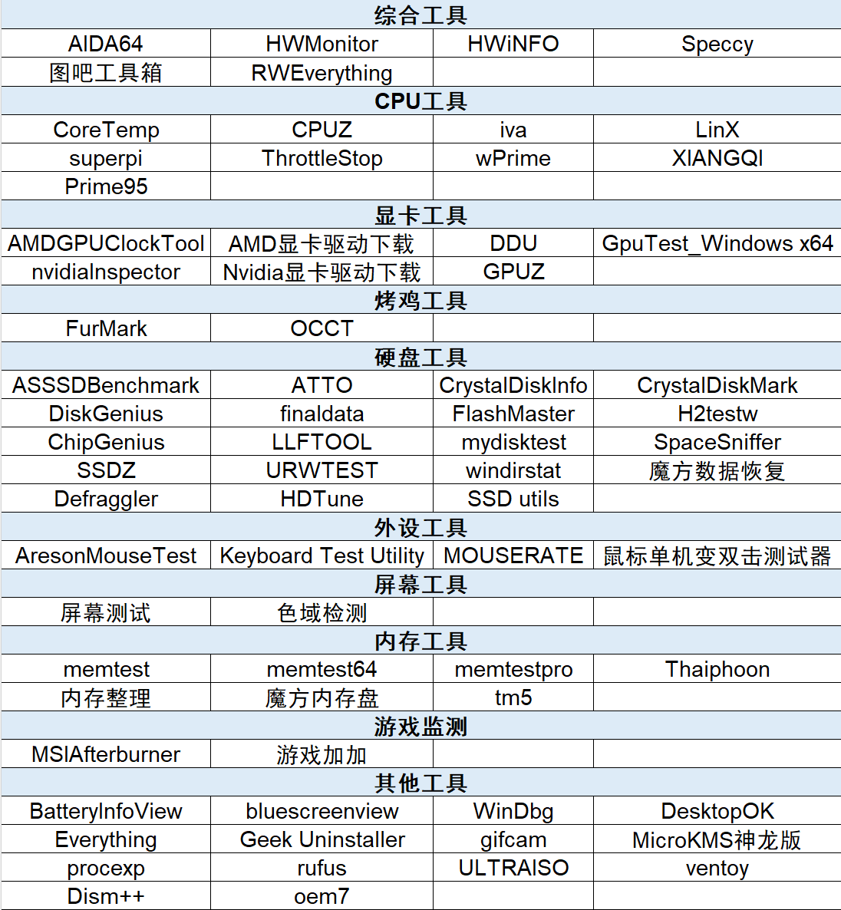

# Ⅰ、入门手册介绍
## 简介

《图拉丁入门手册》是一个详细的、持续更新的、基于MkDocs的开放文档网站，由Tualatin CLUB维护。本站旨在为新入坑的小白萌新提供操作参考，减少QQ群和贴吧的重复提问、低效沟通。

生命不息，折腾不止。欢迎入坑图拉丁。

## 常用工具

## 免责声明

本文档用于装机与软件使用参考，不涉及任何商业用途。如**转载须注明来源**。

若滥用本文档内容，造成盗版侵权、硬件/软件/系统损坏问题，本站不承担任何责任。

## 授权

[图拉丁CLUB](https://tualatin.club)

[图吧工具箱](http://www.tbtool.cn) 

[图拉丁之家](http://www.g4560.cn) 