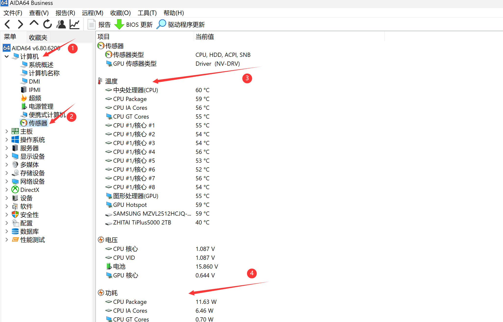
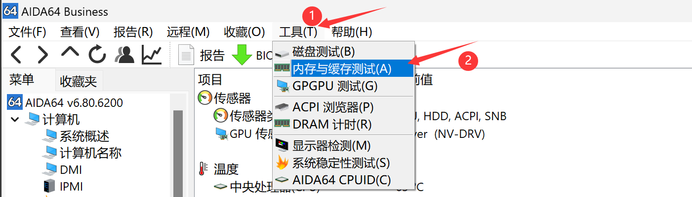
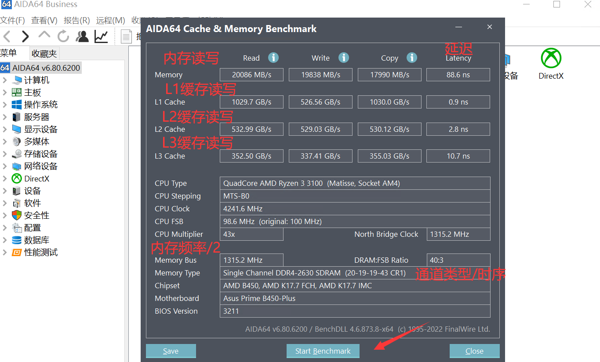
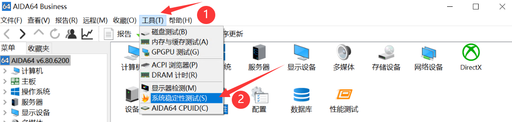
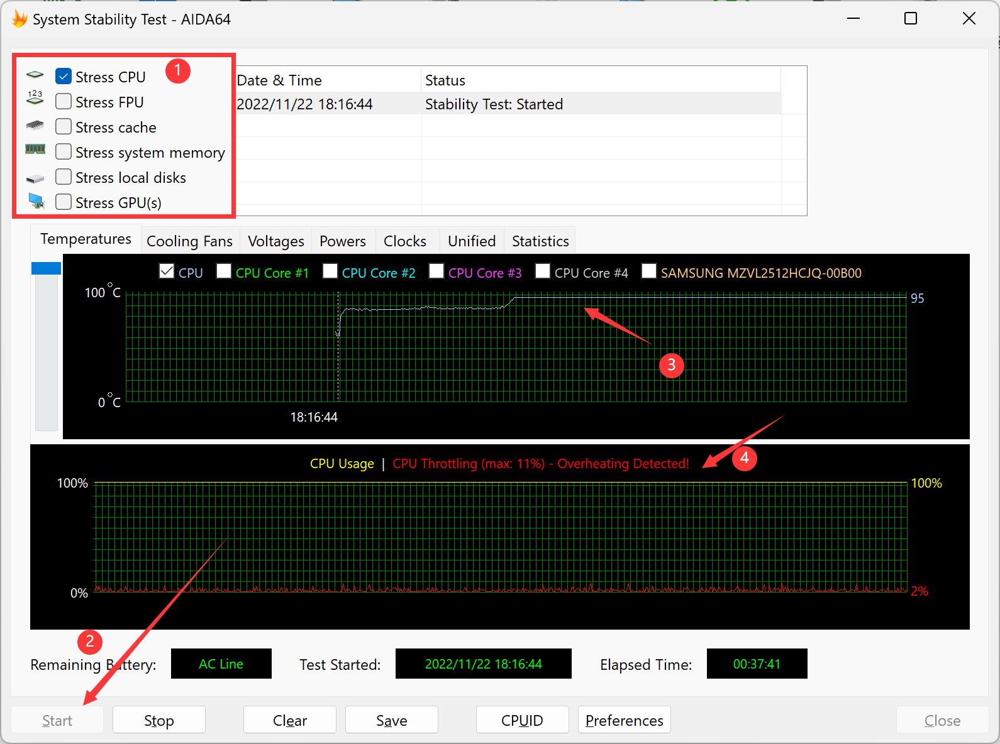

# Ⅲ、综合工具
## 1、AIDA64

### （1）温度与功耗信息

计算机——传感器——温度/功耗

### （2）内存与缓存测试

工具——内存与缓存测试——Start Benchmark

用于测试内存延迟、L3缓存写入减半故障、判断内存通道数。

### （3）压力测试/烤鸡

工具——系统稳定性测试——测试项目——Start

轻薄本选择Stress CPU，渲染本/全能本选择CPU+GPU，台式机选择FPU或FPU+GPU。推荐烤鸡时长，15-30分钟。

### （4）桌面OSD显示

### （5）RemoteSensor副屏监控

## 2、HWMonitor

## 3、HWiNFO

## 4、Speccy

## 5、RWEverything

## 6、图吧工具箱

