# Ⅲ、综合工具
## 1、AIDA64

### （1）温度与功耗信息

* 计算机——传感器——温度/功耗

### （2）内存与缓存测试

* 工具——内存与缓存测试——Start Benchmark

用于测试内存延迟、L3缓存写入减半故障、判断内存通道数。

### （3）压力测试/烤鸡

* 工具——系统稳定性测试——测试项目——Start

轻薄本选择Stress CPU，渲染本/全能本选择双烤CPU+GPU或单烤FPU，台式机选择FPU或FPU+GPU。推荐烤鸡时长，15-30分钟。**CPU Throttling红色标识**为过热降频，即PC散热能力有限。

### （4）桌面OSD显示

* 文件——设置——硬件监视工具——OSD——使用屏显面板显示

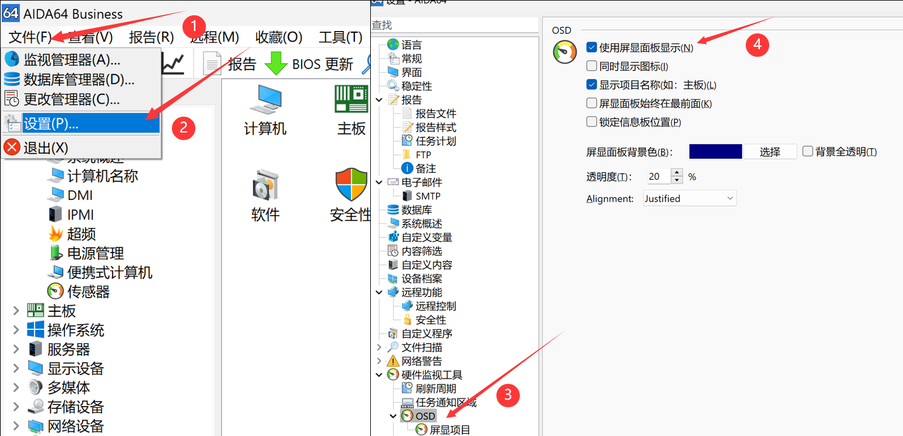

在左侧目录中选择屏显项目，右侧选择需要显示的项目，点击右下角应用即可显示

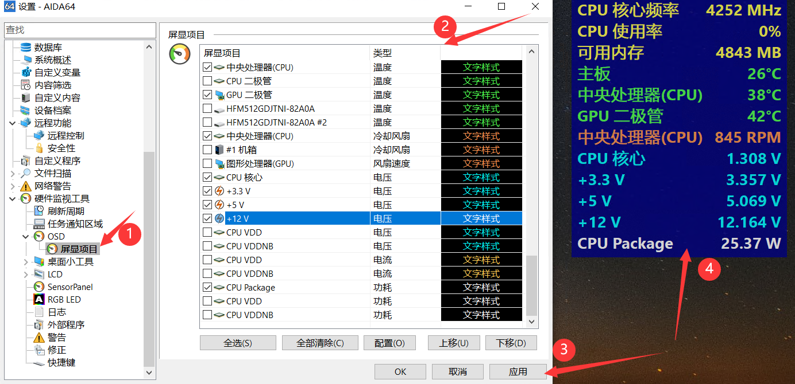

### （5）RemoteSensor副屏监控

* 文件——设置——硬件监视工具——LCD——RemoteSensor——分辨率——启用RemoteSensor LCD支持——背景色——需要全屏的选中Maximize on double-click——应用

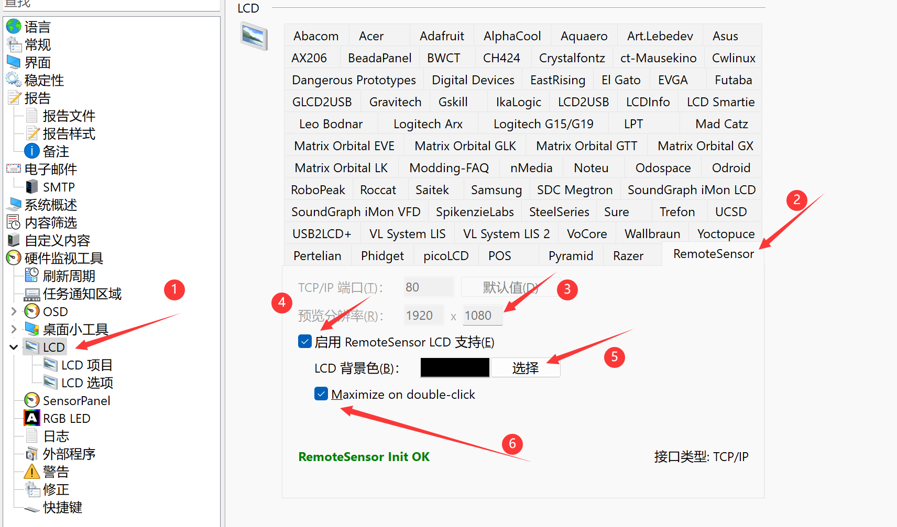

点击左侧LCD项目进入页面编辑。右上角可导入已保存的方案，右中控制各项目的移动，右下为项目新建/编辑/删除和图层顺序调整按钮。伸手党可以去AIDA64论坛上下载，B站也有大量教程。因时间关系本站不做修改和适配。监控屏文本缩放建议调为100%。

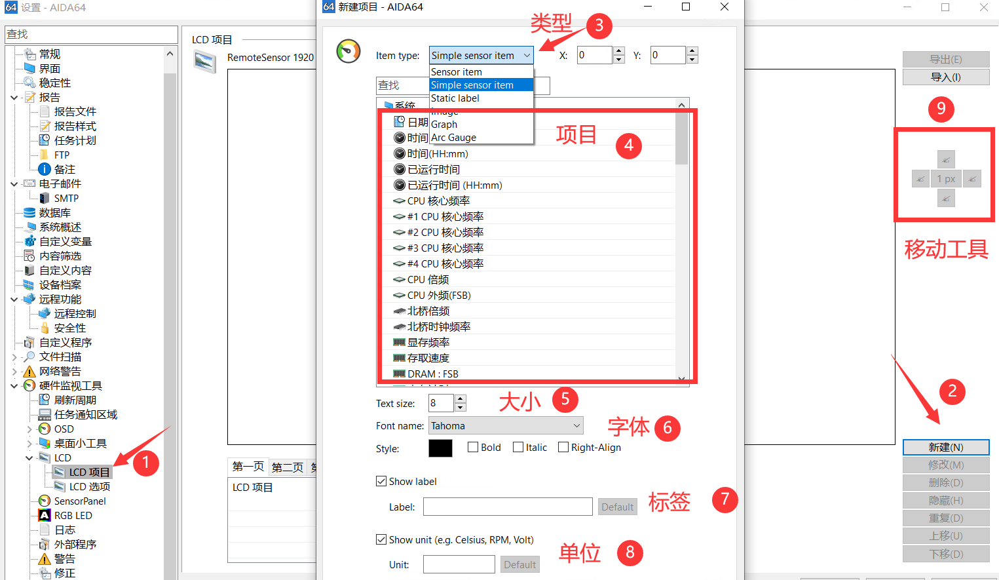

在浏览器中输入【127.0.0.1:端口号】（端口默认80无需输入）即可看到监控页面，在手机/pad等设备浏览器内输入【主机IP:端口号】也可以。在**Wallpaper Engine**中引用【http://主机IP:端口号】并设为直播模式可作为桌面显示。长期使用建议在设置中打开AIDA64的开启启动。

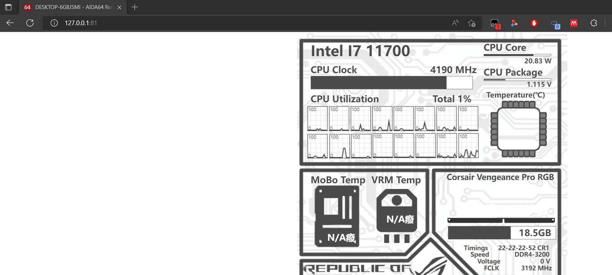

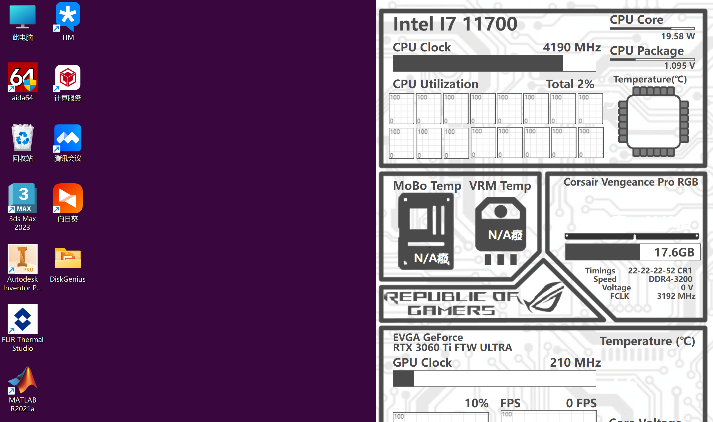

## 2、HWiNFO

### （1）传感器状态

读取本机所有电压、温度、功耗、使用率、频率、磁盘Smart信息，以列表形式呈现。其SDK被各家监控工具广泛使用，如游戏加加(doge)。

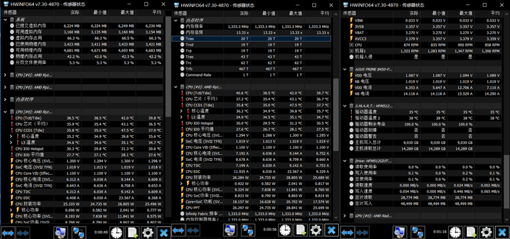

### （2）系统概要

读取CPU、主板、内存、GPU的关键信息，以视窗形式呈现。

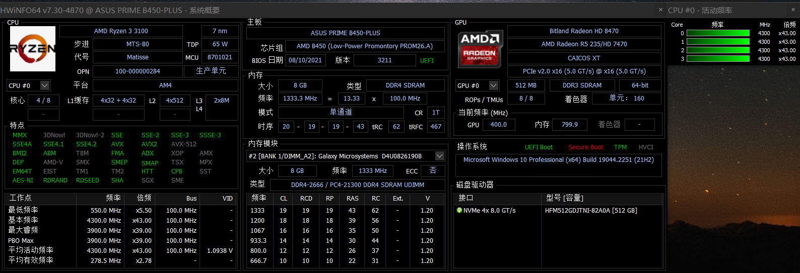

## 3、HWMonitor

## 4、Speccy

 Piriform 的硬件信息查看工具，界面Win7风格，从摘要到各硬件分项信息一应俱全，薄纱鲁大师。

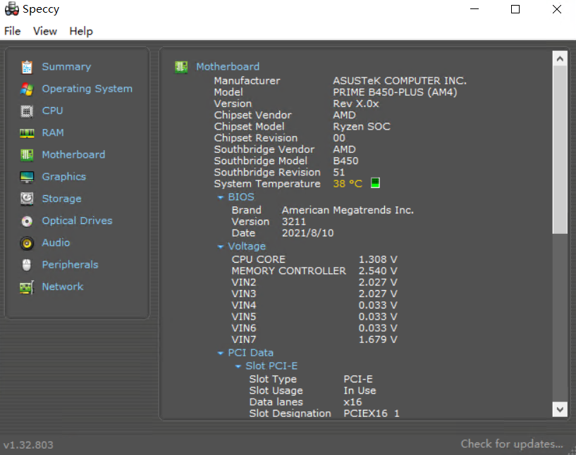

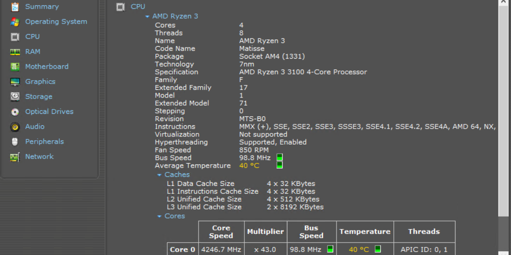

## 5、RWEverything

强大的硬件信息直接读取/修改工具，可直接访问PCI、内存、SPD、SMBus、CPU寄存器，可修改BIOS、内存信息。适用于有BIOS修改经验的玩家使用，滥用导致系统/硬件暴毙责任自负。

该软件已于2017年停更，Win11上因安全策略问题无法使用。相似工具HE在Win11上也已暴毙。

下面以修改DDR3内存为DDR3L为例，介绍RWEverything用法。图文来源SMZDM。

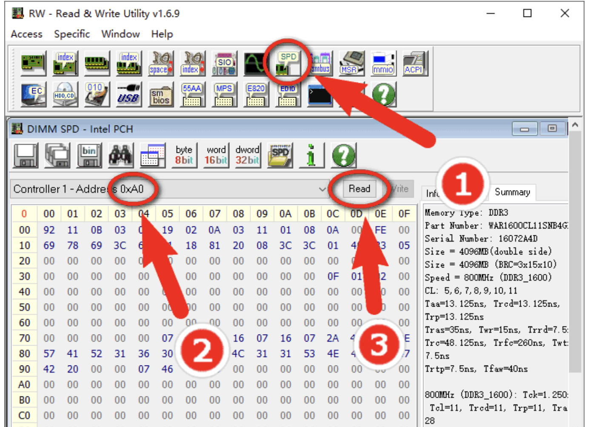

1. 打开RWEverything，点击①处“SPD”图标。  
2. 选择②处的内存地址列表，注意观察右边“Summary”选项卡的内存信息是否是你需要修改的内存，然后记住对应的内存地址，图中示例的地址为“A0”。  

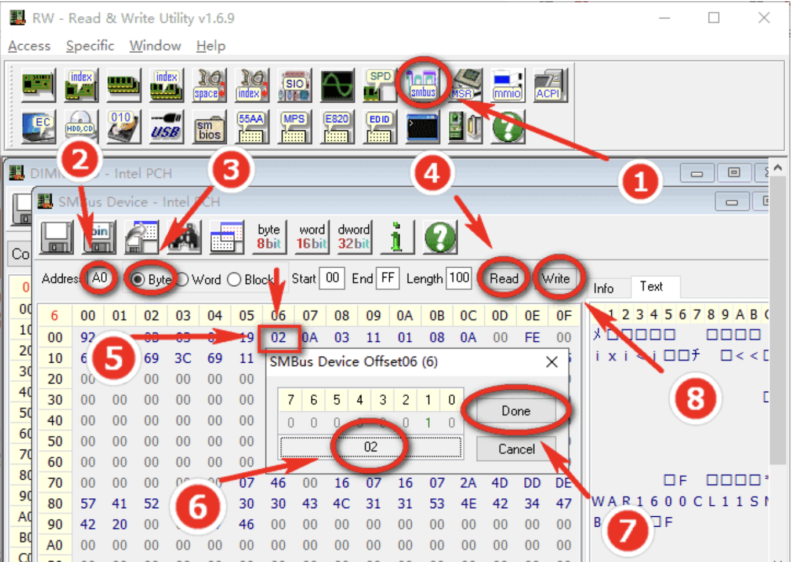

1. 点击①处“SMBUS”图标。  
2. 点击②处填入之前你记住的地址，示例为“A0”  
3. 选择③处的“byte”单选框。  
4. 点击④处的“Read”按钮。  
5. 双击⑤处位于06地址的十六进制数据，会出现新的编辑对话框，标压内存该处数据原本是“00”，示例中已经修改，因此显示“02”。  
6. 修改⑥处中的数据由为“02”，此处00代表仅支持1.5V标压，02代表同时支持1.35V和1.5V。  
7. 点击⑦处“Done”按钮结束编辑。  
8. 点击⑧处的“Write”按钮，将编辑后的数据回写到SPD芯片。  
9. 打开硬件检测软件，内存已经识别为低压内存，电压值为1.35V。重启电脑验证。

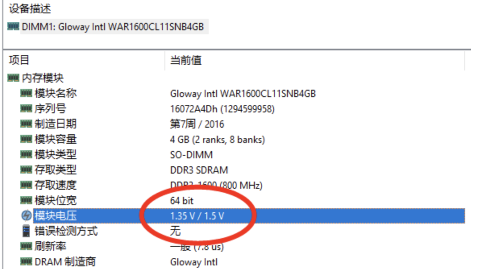

## 6、图吧工具箱

开源、免费、绿色、纯净的硬件检测工具合集，集成了本Doc涉及的所有软件。[点此下载](http://www.tbtool.cn/)。作者在2022.11版本中加入了简单的新手指引。方便易用，有手就会。

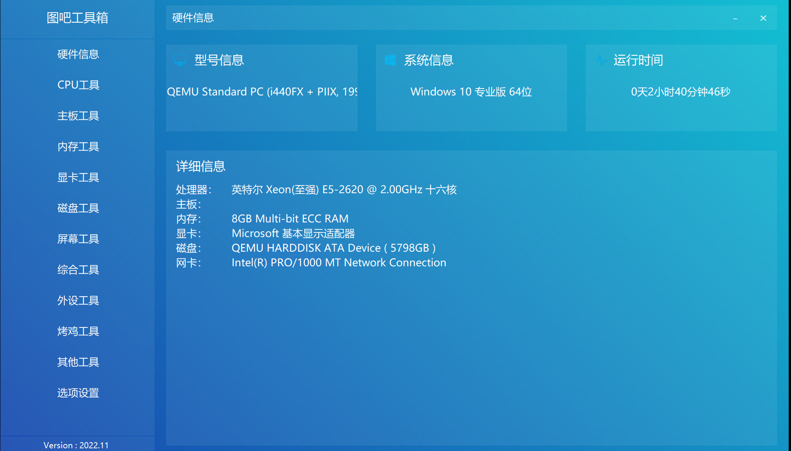

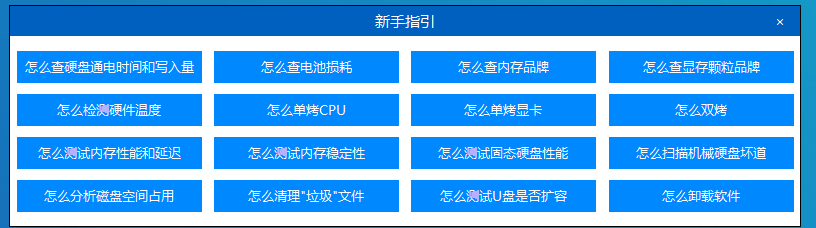

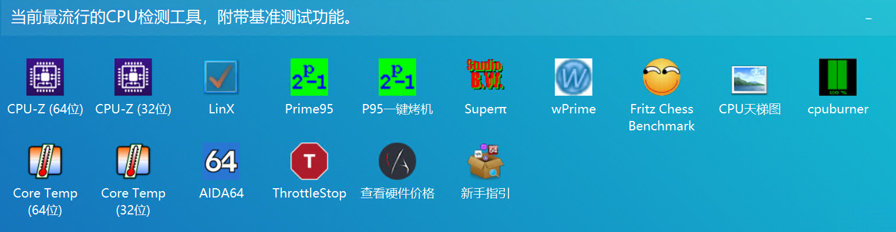

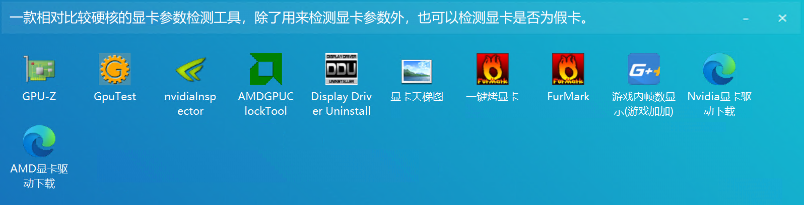

