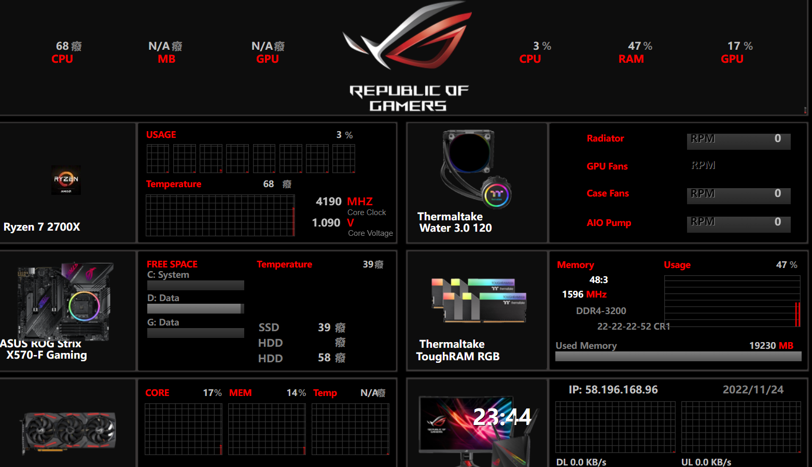

# Ⅲ、综合工具
## 1、AIDA64

### （1）温度与功耗信息

* 计算机——传感器——温度/功耗

### （2）内存与缓存测试

* 工具——内存与缓存测试——Start Benchmark

用于测试内存延迟、L3缓存写入减半故障、判断内存通道数。

### （3）压力测试/烤鸡

* 工具——系统稳定性测试——测试项目——Start

轻薄本选择Stress CPU，渲染本/全能本选择双烤CPU+GPU或单烤FPU，台式机选择FPU或FPU+GPU。推荐烤鸡时长，15-30分钟。**CPU Throttling红色标识**为过热降频，即PC散热能力有限。

### （4）桌面OSD显示

* 文件——设置——硬件监视工具——OSD——使用屏显面板显示

在左侧目录中选择屏显项目，右侧选择需要显示的项目，点击右下角应用即可显示

### （5）RemoteSensor副屏监控

* 文件——设置——硬件监视工具——LCD——RemoteSensor——分辨率——启用RemoteSensor LCD支持——背景色——需要全屏的选中Maximize on double-click——应用

点击左侧LCD项目进入页面编辑。右上角可导入已保存的方案，右中控制各项目的移动，右下为项目新建/编辑/删除和图层顺序调整按钮。伸手党可以去AIDA64论坛上下载，B站也有大量教程。因时间关系本站不做修改和适配。监控屏文本缩放建议调为100%。

在浏览器中输入【127.0.0.1:端口号】（端口默认80无需输入）即可看到监控页面，在手机/pad等设备浏览器内输入【主机IP:端口号】也可以。在**Wallpaper Engine**中引用【http://主机IP:端口号】并设为直播模式可作为桌面显示。长期使用建议在设置中打开AIDA64的开启启动。

## 2、HWiNFO

### （1）传感器状态

读取本机所有电压、温度、功耗、使用率、频率、磁盘Smart信息。以列表形式呈现。

## 5、RWEverything

强大的硬件信息直接读取/修改工具，可直接访问PCI、内存、SPD、SMBus、CPU寄存器，可修改BIOS、内存信息。适用于有BIOS修改经验的玩家使用，滥用导致系统/硬件暴毙责任自负。

已于2017年停更，Win11上因安全策略问题无法使用。相似工具HE在Win11上也已暴毙。

未完待续……

## 6、图吧工具箱

