# Ⅱ、Win系统安装

```
三千预算进卡吧，加钱加到九万八。十核E7装上去，四路泰坦抱回家。  
4K屏幕组三屏，万元水冷温度压。固态硬盘装三块，硬盘内存使劲加。  
键鼠必花几千块，耳机手柄八千八。还有机箱一万一，红星炸弹啪啪啪。  
最后发现没啥用，抱着神机刷贴吧。   

三千预算进图吧，学校对面开网吧。AN矿卡是标配，垃圾靠岸笑哈哈。  
坏道迈拓装系统，并口硬盘论车拉。老式志强超频爽，奔腾菜羊够用啦。  
十手矿卡装上去，鱼竿内存满箱插。机箱路边随便捡，安踏鞋盒擦一擦。  
机械键盘自己搞，鼠标一斤一块八。人人手拿七七五，家家双路叉五八。  
萝卜散热效果好，牙膏硅脂温度压。二手便宜质量好，一切信仰就是渣。  

——大人，时代变了，好好装机！本教程面向Windows平台。  
```

## 1、准备工作
（A）一个U盘（≥8GB），存放安装镜像  
（B）一个联网、可以读写USB的电脑或手机  
（C）一个准备安装系统的PC 

## 2、 创建引导U盘
### 方法一、官方工具全自动创建

1、下载镜像生成工具：  
Windows 10：[https://www.microsoft.com/zh-cn/software-download/windows10](https://www.microsoft.com/zh-cn/software-download/windows10)  
Windows 11：[https://www.microsoft.com/zh-cn/software-download/windows11](https://www.microsoft.com/zh-cn/software-download/windows11)

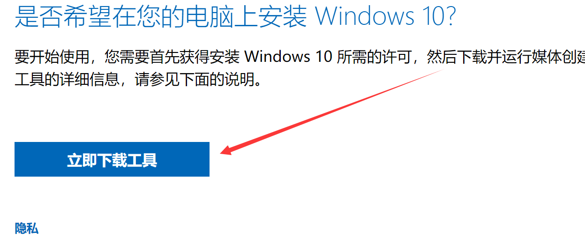

2、插入U盘，打开MediaCreationToolxxxx.exe。选择创建安装介质。

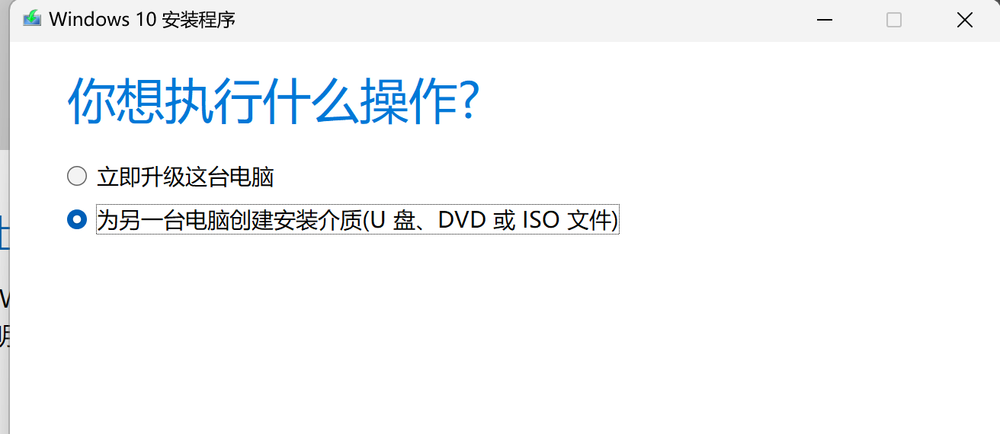

3、版本选择Windows 10 / Windows 11，默认包含全版本安装文件。体系一般为x64。

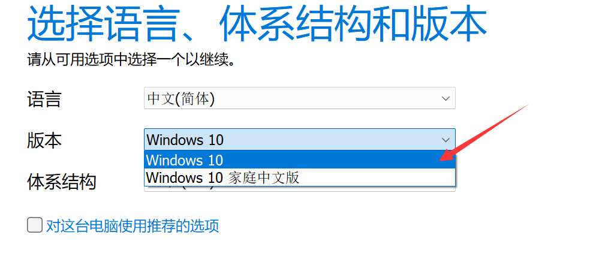

4、选择创建方式。推荐选择**U盘**，一步到位。若需单独使用iso镜像，则选择**ISO文件**。

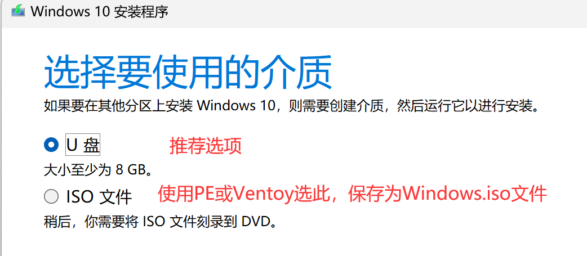

5、点击下一步（ISO方式记住保存路径，按方法二/三/四继续操作），等待创建完成。

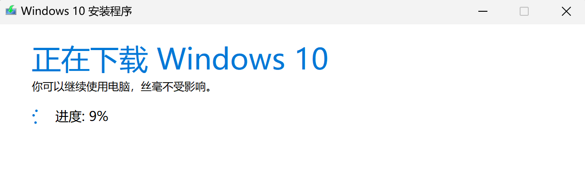

### 方法二、手动下载镜像解压

1、准备ISO镜像，使用上方工具创建ISO文件，或从Next,ITellYou网站下载，点击[NEXT, ITELLYOU](https://next.itellyou.cn/)。


2、下载选择商业版/business版，后续适用各种激活方式。复制ED2K或BT自行下载。

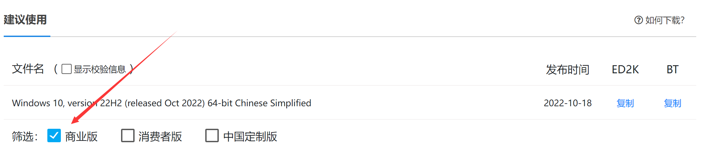

3、下载镜像后解压镜像内文件至U盘根目录。U盘格式推荐为FAT32，兼容性最佳。解压完成即可引导安装。

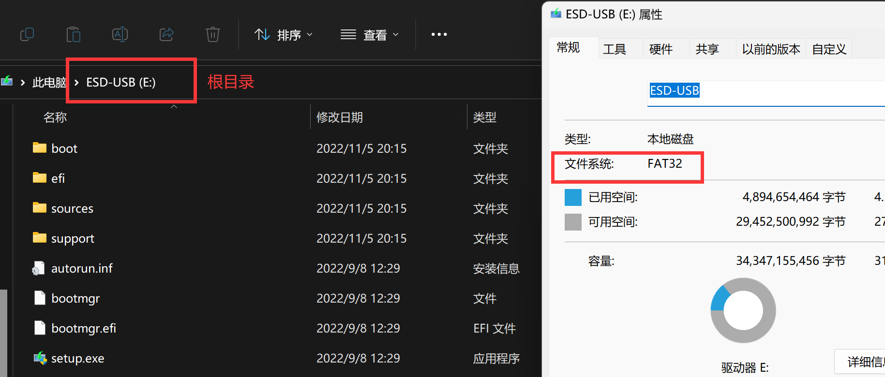

### 方法三、Rufus写入U盘

1、准备ISO镜像，方法如上。

2、下载Rufus（图吧工具箱内置，其他工具-Rufus），[点此手动下载3.20版本](https://github.com/pbatard/rufus/releases/download/v3.20/rufus-3.20.exe)。

3、插入U盘，打开Rufus，选择镜像。  
* 不支持EFI引导的平台分区类型选择MBR，否则保持默认。  
* 固态U盘、移动硬盘需启用**显示USB外置硬盘选项**。  
* 文件系统选择FAT32以保持最大兼容。   

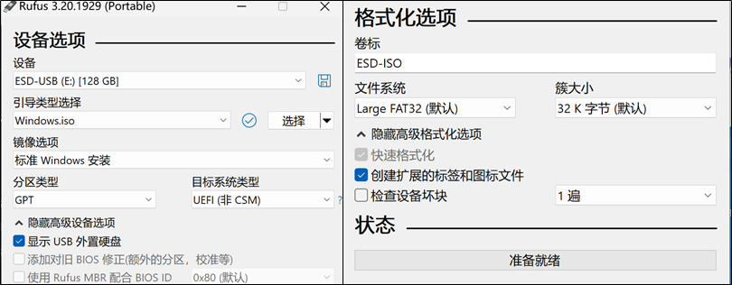

4、点击开始按钮，安装弹窗按需选择。等待镜像写入完成。

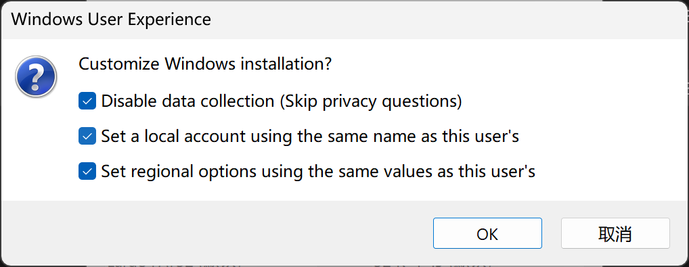

### 方法四、PE类工具安装

1、下载PE，推荐[WePE](https://mirrors.sdu.edu.cn/software/Windows/WePE/WePE64_V2.2.exe)，插入U盘创建启动盘。

2、准备ISO镜像，无需解压直接拷入**微PE工具箱**分区。

## 3、引导启动安装镜像
### 一、可选：主板BIOS启动类型设置

新平台默认UEFI引导，CSM兼容关闭，无特殊需求保持默认即可。
Legacy——Win10 MBR磁盘分区格式、不兼容EFI启动的老显卡需要该功能，在CSM Support中开启。
UEFI——11年后主板普遍支持UEFI启动，若无Legacy设备，直接选择UEFI Only即可。

1、开机**狂按**DEL进入BIOS，特殊主板详见启动LOGO下方标注、主板说明书或自行百度

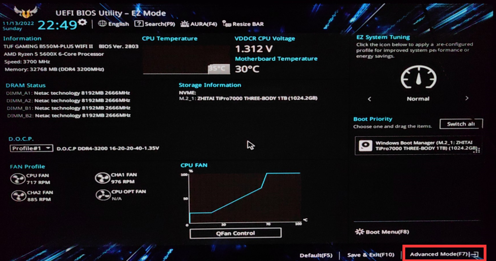

2、BIOS中选择Boot菜单（部分主板需先进入高级模式，见上图红框），选择CSM

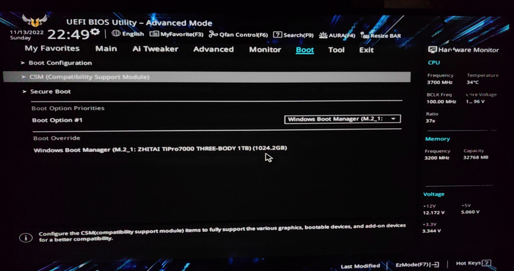

3、CSM选项中选择开启或关闭，部分主板为CSM supported / legacy only / uefi only，混合模式兼容性最佳。

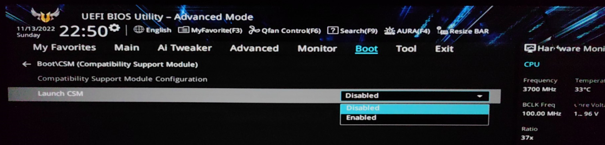

4、保存设置并重启，默认快捷键为F10。

### 二、选择U盘启动

按下开机键后**狂按**快捷键进入Boot菜单，华硕F8，微星F11，技嘉F12，其他主板详见启动LOGO下方标注、主板说明书或自行百度。根据需要选择U盘引导选项，默认选择**UEFI：XXXX**项，有特殊需求或老平台选择**U盘名称**项。回车后从U盘启动。PE引导需手动打开Windows安装镜像。

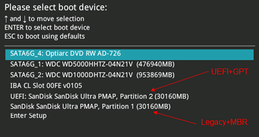

### 三、选择目标硬盘并安装

1、进入安装程序，操作系统推荐专业版，安装类型除升级外均选择第二项：**仅安装Windows**。

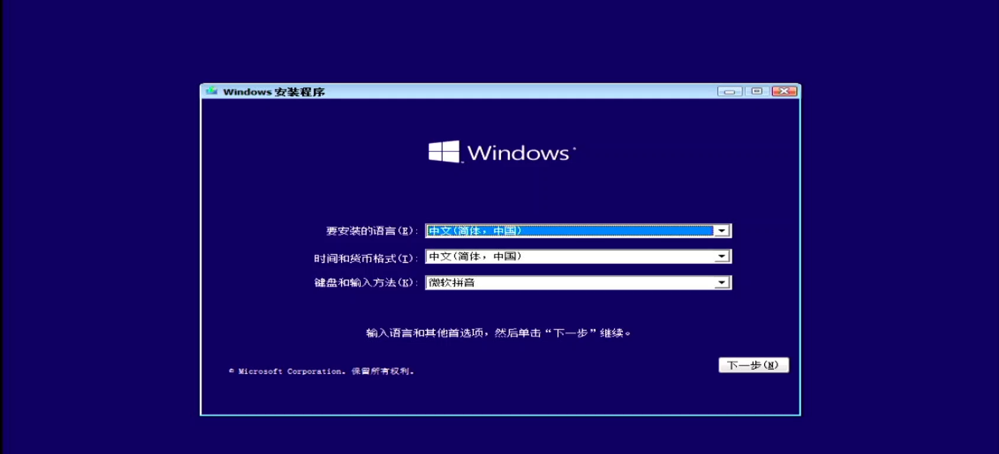


2、选择目标硬盘，点击下一步开始安装。完成后拔出U盘重启。
11/12代酷睿不显示硬盘问题的详见下文注入驱动部分。

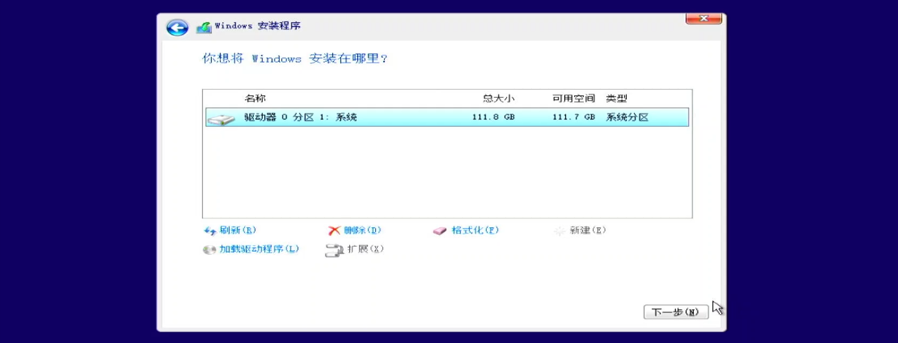

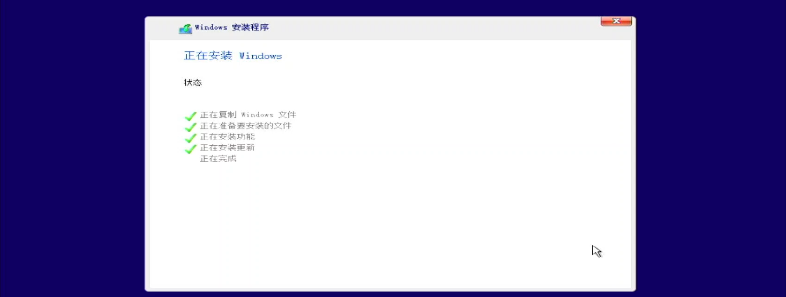

3、系统初始化，按需选择，完成安装。
MT7921等无线网卡不显示Wifi连接问题的详见下文注入驱动部分。

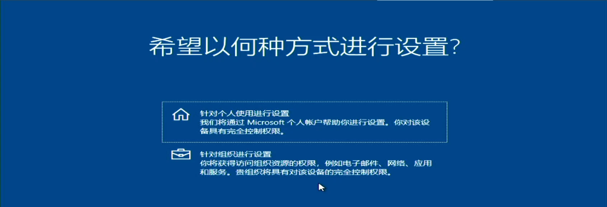

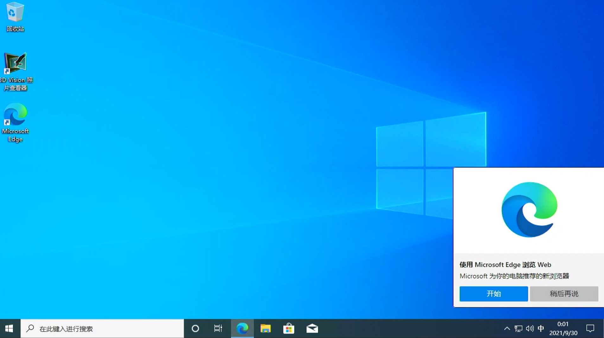

## 4、可选：注入驱动

* 由于11/12代酷睿使用了新的VMD磁盘管理驱动，Windows 10 22H1之前的版本安装无法显示硬盘。

* 由于MT7921网卡未提供兼容驱动，官网Windows镜像无法连接WIFI。

* 特殊硬件无兼容驱动，官网Windows无法正确识别。

上述问题可以在BIOS中进行设置规避，也可在Windows安装过程中手动注入驱动。
下方以VMD问题为例进行操作，其他问题类似。

1、Intel官网或主板官网下载IRST_VMD驱动，[官网链接](https://www.intel.cn/content/www/cn/zh/download/15667/intel-rapid-storage-technology-intel-rst-user-interface-and-driver.html?wapkw=rapid%20storage%20technology)，注意下载zip压缩包版本。

2、解压，在安装程序中加载驱动程序，即可识别硬盘

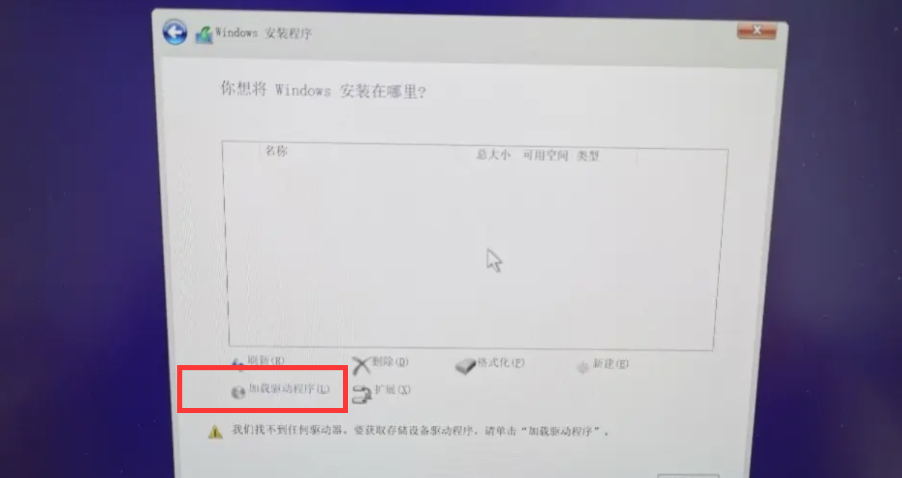

